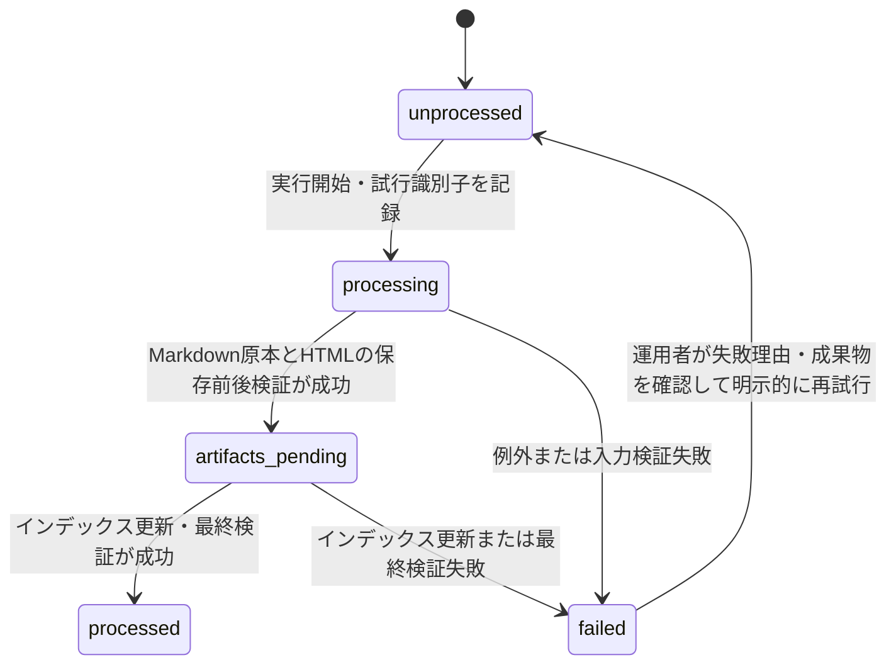

# KNB-PM-001 Output層整合性・安全性改善 開発タスク管理

| 項目         | 内容                            |
| :----------- | :------------------------------ |
| 文書番号     | KNB-PM-001                      |
| 版数         | 0.1                             |
| 作成日       | 2026-08-27                      |
| 更新日       | 2026-08-27                      |
| 対象ブランチ | `fix-output-consistency-safety` |
| 管理状態     | 実装着手前                      |

## 1. 目的と背景

GitHub Issue #11（OpenSpec）および #13（Aider）は `failed` である一方、現行処理はHTML保存後にインデックス同期、完了状態更新を実施する。後段で失敗すると、記事ファイル・インデックス・Issue状態が不整合になり得る。また、Issue処理は構造化JSONをLLMに要求しているため、レビューで決定済みのMarkdown入力経路を通らない。

本計画では、LLM出力をMarkdownに統一し、検証済みMarkdown原本、HTML記事、インデックス、およびIssue状態を一貫して扱う。失敗した既存Issueを自動再実行することは本計画の完了条件ではない。再実行前に、失敗理由と成果物の実態を記録して個別に判定する。

## 2. 決定事項

| ID   | 決定                                                                       | 理由                                                                                  |
| :--- | :------------------------------------------------------------------------- | :------------------------------------------------------------------------------------ |
| D-01 | LLM記事出力の正規入力をMarkdownとする                                      | `ArticleBuilder` のMarkdown経路、引用処理、検証を一つの入力契約に集約するため         |
| D-02 | 生成Markdownを `data/article_sources/issue-<番号>.md` に保存する           | LLM出力を再現・監査・デバッグし、HTML再生成を外部調査・LLM呼出しから分離するため      |
| D-03 | 状態の正本は `data/issue_status.json` を維持し、RDBは導入しない            | 要求規模に対してRDBは過剰であり、必要な耐障害性は原子的書込みと状態遷移で満たせるため |
| D-04 | JSON、Markdown、HTML、インデックスは共通の原子的書込みモジュールを経由する | 部分書込みによる破損を防ぎ、永続化の失敗契約を局所化するため                          |
| D-05 | 既存の構造化JSON生成・JSON修復経路はMarkdown移行時に廃止する               | 二重の入力契約と `lead_text` 未初期化を残さないため                                   |
| D-06 | 未仕様のMarkdown構文は受理せず、明示的な検証エラーにする                   | `safe` 出力へ未検証構文を通さず、安全な対応範囲を固定するため                         |

## 3. 対象範囲

### 3.1 今回実施する範囲

- Issue処理状態に失敗理由、失敗時刻、処理試行識別子、成果物記録を追加する設計と実装
- Markdown原本の保存、HTML生成、インデックス更新、状態確定の処理順序と失敗時補償
- Markdown専用プロンプト、Markdown入力DTO、旧JSON経路の撤去
- HTMLエスケープ、HTTPS限定URL、許可構文方式の入力検証
- Stage 5の保存前・保存後検証
- JSON、Markdown、HTML、インデックスの原子的書込み
- #11/#13の失敗状態と成果物を記録・再同期するための運用手順
- 関連設計書、テスト仕様、単体・統合テストの更新

### 3.2 今回実施しない範囲

| 項目                                                        | 扱い                       |
| :---------------------------------------------------------- | :------------------------- |
| パーソナルナレッジIssueの12時間無更新検出、記事化、クローズ | スコープ外                 |
| `personal_knowledge_config.json` のGitHub設定統合           | スコープ外                 |
| 定期実行方式の統一、`_ensure_utc` の共通化                  | スコープ外                 |
| H4以降、ネストリスト、引用ブロック、画像、Mermaid静的化     | 仕様決定後の別タスク       |
| QA／引用文脈レビュー用Skillの実装                           | レイヤー違いのため対象外   |
| ルートREADMEの新設                                          | 本変更と独立した運用タスク |

## 4. 実装方針

### 4.1 深いモジュールとシーム

| モジュール                          | 外部インターフェース                                 | 隠蔽する実装                                                                        | シームとアダプター                                                                   |
| :---------------------------------- | :--------------------------------------------------- | :---------------------------------------------------------------------------------- | :----------------------------------------------------------------------------------- |
| 原子的書込みモジュール              | `write_text(path, content)`                          | 同一ディレクトリの一時ファイル作成、UTF-8/LF書込み、flush、`os.replace`、失敗時清掃 | ファイルシステム操作を注入できる内部シーム。テストでは失敗する書込みアダプターを使う |
| 記事入力検証モジュール              | `validate_markdown(markdown)`、`validate_html(html)` | frontmatter、必須要素、禁止構文、URL、引用対応、HTML骨格の検査                      | 検証結果DTOを返す。保存モジュールから独立し、副作用を持たない                        |
| Issue成果物コミットメントモジュール | `process(issue)`                                     | Markdown原本保存、HTML生成、インデックス同期、検証、補償、状態遷移                  | `IssueManager`、記事ビルダー、インデックス更新をアダプターとして受け取る             |

この分割により、呼出し側は一つのIssue処理インターフェースで完結し、ファイル操作・検証・補償の詳細を知らない。原子的書込みと検証を共通化することで、他のJSONキューや将来の出力にも再利用できる。

### 4.2 Issue状態遷移と失敗契約



- `failed` には少なくとも `failure_reason`、`failed_at`、`attempt_id`、`article_source_file`、`article_file`、`index_synced` を保持する。
- `failure_reason` は例外種別、処理段階、利用者向け要約を永続化する。秘密情報、LLM応答全文、環境変数は記録しない。
- `processed` はMarkdown原本、HTML、インデックスの検証成功後にのみ設定する。
- 途中失敗時は、直前の有効なHTML・インデックスを保持する。今回作成した未確定のMarkdown原本・HTMLは削除するか、診断用に保持するかを状態レコードで明示する。暗黙の残存を許可しない。
- 既存の `failed` は自動的に `unprocessed` へ戻さない。#11/#13は次節の手順によって個別に分類する。

### 4.3 Markdown入力契約

| 区分       | 今回許可する構文                                                                                                            | 条件                                          |
| :--------- | :-------------------------------------------------------------------------------------------------------------------------- | :-------------------------------------------- |
| メタデータ | YAML frontmatterの`title`、`eyebrow`、`lead`                                                                                | 値はプレーンテキストとしてHTMLエスケープする  |
| 本文       | H1～H3、段落、単層の順序付き／順序なしリスト、インラインコード、コードフェンス、Pipe Table、定型Q&A、定型参考文献、引用番号 | 構文検証とHTMLエスケープを通過すること        |
| リンク     | Markdownリンクおよび参考文献URL                                                                                             | `https`、絶対URL、許可されたURL形式であること |

| 今回拒否する構文                                                  | 拒否理由                                       |
| :---------------------------------------------------------------- | :--------------------------------------------- |
| 生HTML、イベント属性、`javascript:` 等のスキーム                  | `body_html                                     | safe` へ危険な文字列を渡さないため |
| HTTP、相対URL、資格情報を含むURL                                  | HTTPS限定・外部リンクの安全性を保つため        |
| H4以降、ネストリスト、引用ブロック、画像、Mermaid                 | 対応仕様・静的化・サニタイズ方針が未決定のため |
| 未閉鎖コードフェンス、必須frontmatter欠落、引用と参考文献の不整合 | 保存前に明示的な入力エラーとするため           |

### 4.4 保存前後の検証

| 段階               | 検証項目                                                                                 | 失敗時                                    |
| :----------------- | :--------------------------------------------------------------------------------------- | :---------------------------------------- |
| 保存前             | 必須frontmatter、見出し構造、許可構文、禁止構文、HTTPS URL、引用番号と参考文献の対応     | 原本・HTMLを公開せず`failed`を記録        |
| Markdown原本保存後 | 原本の再読込、UTF-8/LF、同一内容、パスの妥当性                                           | 作成物を補償し`failed`を記録              |
| HTML保存後         | doctype、`html[lang=ja]`、title、main/article、引用アンカーと参考文献ID、全リンクのHTTPS | 作成物を補償し`failed`を記録              |
| インデックス更新後 | 記事へのリンク、タイトル、日付、重複なし                                                 | 前回indexを保持または復元し`failed`を記録 |

## 5. 開発タスク

| ID     | 優先度 |  状態  | 依存                   | タスク                                                                            | 完了条件                                                                |
| :----- | :----: | :----: | :--------------------- | :-------------------------------------------------------------------------------- | :---------------------------------------------------------------------- |
| PM-00  |   P0   |  完了  | -                      | 専用ブランチと本管理文書を作成する                                                | `fix-output-consistency-safety` と本ファイルが存在する                  |
| OUT-01 |   P0   | 未着手 | -                      | Issue状態スキーマと遷移契約を詳細設計・データ構造仕様へ反映する                   | 失敗理由、試行、成果物、補償方針がSSOTに定義される                      |
| OUT-02 |   P0   | 未着手 | OUT-01                 | 原子的書込みモジュールを実装し、既存JSON・Markdown・HTML・indexの保存に適用する   | 書込み失敗で既存正本が破損せず、一時ファイルが残らない                  |
| OUT-03 |   P0   | 未着手 | OUT-01, OUT-02         | Markdown入力DTO、原本保存先、再生成手順を定義・実装する                           | Markdown原本だけでHTML再生成を実行できる                                |
| OUT-04 |   P0   | 未着手 | OUT-03                 | Issue同期処理をMarkdown専用プロンプト・入力へ移行し、JSON生成／修復経路を削除する | `ArticleBuilder` へ `markdown_text` が渡り、JSONパースを行わない        |
| OUT-05 |   P0   | 未着手 | OUT-03                 | Markdown・HTML・URLの許可方式検証を実装する                                       | 危険HTML、非HTTPS URL、未対応構文、未閉鎖フェンスを保存前に拒否する     |
| OUT-06 |   P0   | 未着手 | OUT-02, OUT-04, OUT-05 | 保存前後検証と失敗補償をIssue成果物コミットメントへ統合する                       | どの段階で失敗しても状態と成果物が矛盾せず、失敗理由を追跡できる        |
| OUT-07 |   P0   | 未着手 | OUT-06                 | #11/#13を調査し、状態・原本・HTML・indexを再同期する運用手順を実行する            | 個別の失敗理由と再試行可否が記録され、承認済みのIssueだけが再処理される |
| OUT-08 |   P1   | 未着手 | OUT-01～OUT-06         | 設計書、テスト仕様書、既存テストを更新する                                        | 新契約が設計・テスト・実装で矛盾しない                                  |

### 5.1 OUT-01: 状態スキーマと遷移契約

- 対象: `data/issue_status.json`、Issue管理モジュール、`KNB-DD-001`、`KNB-DS-001`。
- `failed` の原因を状態とログに分ける。状態には検索可能な要約と段階を保存し、詳細スタックトレースは実行ログに限定する。
- `article_source_file` と `article_file` は成功時だけでなく、診断用に保持する場合の状態も定義する。
- ステータスの追加・名称変更は、既存の`unprocessed`、`processing`、`processed`、`failed`との後方互換性を評価してから行う。

### 5.2 OUT-02: 原子的書込み

- 同一ディレクトリに一時ファイルを作成し、UTF-8（BOMなし）・LFで完全に書込み、成功後に`os.replace`する。
- 同じ共通モジュールをJSON、Markdown、HTML、indexに使用する。書込み呼出し側で一時ファイル手順を再実装しない。
- 既存ファイルの置換に失敗したとき、以前の正本を保持し、一時ファイルの清掃失敗を診断できるようにする。
- 同時実行の排他要件は、現状の単一同期プロセス前提を設計へ明記する。複数実行を許可する場合は別タスクでロック方式を決定する。

### 5.3 OUT-03～OUT-04: Markdown原本とIssue同期

- LLMには、frontmatter、本文、Q&A、要点、引用、参考文献を含むMarkdownだけを出力させる。
- 応答Markdownは保存前検証に通した後、`data/article_sources/issue-<番号>.md`へ保存する。失敗した応答を診断目的で保持する場合は、公開原本とは別パス・短期保持・秘密情報非保存の規約を定義する。
- HTMLは保存済み原本から生成する。HTMLの再生成は原本を入力とし、LLMや外部リサーチを再実行しない。
- 旧構造化JSON経路、JSONコードフェンス抽出、JSON修復を削除する。移行中にも`lead_text`を常に初期化し、例外を残さない。

### 5.4 OUT-05～OUT-06: 安全性、検証、補償

- Markdownから出す全てのテキストをHTMLエスケープする。許可済みのタグ・属性だけを生成し、外部入力を`safe`として直接渡さない。
- URLは標準ライブラリでscheme・host・資格情報・制御文字を検査し、`https`以外を拒否する。リンクの文言もHTMLエスケープする。
- 保存前検証と保存後検証を分離し、検証モジュールは副作用なしの結果DTOを返す。
- 処理途中の失敗では、公開済み成果物を壊さず、今回の成果物を補償する。補償不能の場合は成果物パスと残存理由を`failure_reason`に記録する。

### 5.5 OUT-07: #11/#13 の再同期手順

1. `failed` 状態のまま、対象IssueのHTML、Markdown原本、indexリンクの有無を読み取り専用で確認する。
2. 実行ログから失敗した段階を特定し、存在しない場合は「履歴不足」として状態に記録する。推測で成功・失敗を上書きしない。
3. 既存成果物がある場合は、HTML骨格・参照・indexを新しい検証器で評価する。
4. 有効な成果物が確認できた場合は、状態を`processed`へ変更する根拠、原本の有無、再生成要否を記録する。無効または不存在なら`failed`を維持する。
5. 再試行は失敗理由を解消し、利用者が対象Issueを明示承認した後にだけ実施する。
6. 再試行後、原本・HTML・index・状態の全てを検証し、結果と試行識別子を記録する。

## 6. テストと検証

| ID     | 対象           | 代表ケース                                                      | 期待結果                                                   |
| :----- | :------------- | :-------------------------------------------------------------- | :--------------------------------------------------------- |
| VAL-01 | 原子的書込み   | 一時ファイル書込み、置換、置換失敗                              | 失敗しても従前のJSON/Markdown/HTML/indexが保持される       |
| VAL-02 | 状態遷移       | Markdown保存、HTML保存、index更新の各段階で失敗                 | `failed`の段階・理由・成果物情報が残り、不整合が補償される |
| VAL-03 | Markdown移行   | LLMがMarkdownを返す                                             | JSON抽出・修復なしで原本保存からHTML生成まで成功する       |
| VAL-04 | Markdown安全性 | 生HTML、イベント属性、H4、画像、ネストリスト、未閉鎖フェンス    | 保存前検証で明確に拒否される                               |
| VAL-05 | URL安全性      | `http`、`javascript`、相対URL、資格情報付きURL、正当なHTTPS URL | 正当なHTTPSのみが通過する                                  |
| VAL-06 | HTML検証       | doctype、`lang`、引用アンカー、参考文献ID、リンク               | 欠落・不整合を保存後検証で検出する                         |
| VAL-07 | 再生成         | 保存済みMarkdown原本                                            | LLM・外部リサーチを呼ばず同等のHTMLを生成できる            |
| VAL-08 | 既存Issue      | #11、#13                                                        | 自動再試行せず、失敗理由・成果物・判断根拠を記録できる     |

実装ごとに対象テストを先に追加し、タスク完了時には以下を実行する。

```powershell
python -m pytest tests/test_issue_manager.py tests/test_markdown_parser.py -v
python -m pytest -v
python -m ruff check src tests
python -m mypy src
```

外部LLM、Deep Research、GitHub APIを使用する結合実行は、機密情報を含まないテスト用設定と明示承認がある場合に限定する。通常の完了判定はモック化したテストで行う。

## 7. 更新対象とトレーサビリティ

| 実装タスク | 更新する正本／テスト                                        |
| :--------- | :---------------------------------------------------------- |
| OUT-01     | `KNB-DD-001`、`KNB-DS-001`、Issue管理テスト                 |
| OUT-02     | `KNB-DS-001`、原子的書込みモジュールのテスト                |
| OUT-03     | `KNB-DD-002`、`KNB-DS-001`、Markdown原本・再生成テスト      |
| OUT-04     | `KNB-DD-001`、`KNB-DD-002`、Issue単体処理テスト             |
| OUT-05     | `KNB-DD-002`、`KNB-RV-001`、Markdownパーサー／URLテスト     |
| OUT-06     | `KNB-DD-001`、`KNB-DD-003`、状態遷移・HTML・index統合テスト |
| OUT-08     | `KNB-TEST-001`、本書、関連する設計書の版数・改訂履歴        |

## 8. 完了判定

次の全てを満たしたとき、P0を完了とする。

1. Markdownが唯一のLLM記事入力であり、構造化JSON生成・修復経路が存在しない。
2. Markdown原本、HTML、インデックス、Issue状態の全てが原子的書込みを使用する。
3. 任意の処理段階の失敗について、既存公開成果物が破損せず、失敗理由と残存成果物が追跡できる。
4. 未対応Markdown構文、危険HTML、非HTTPS URL、未閉鎖コードフェンス、引用不整合を保存前に拒否できる。
5. 保存後にHTML骨格、引用アンカー、参考文献、URL、indexリンクを検証できる。
6. #11/#13について、成果物実態、失敗理由、再試行可否が記録される。再試行は明示承認なしに行わない。
7. 第6節のテスト、lint、型検査が成功し、関連設計書とテスト仕様が実装に追従している。

## 9. 改訂履歴

| 版数 | 日付       | 変更内容 | 変更理由                                                       |
| :--- | :--------- | :------- | :------------------------------------------------------------- |
| 0.1  | 2026-08-27 | 初版作成 | Output層の不整合、安全性、永続化を実装可能な順序へ整理するため |
