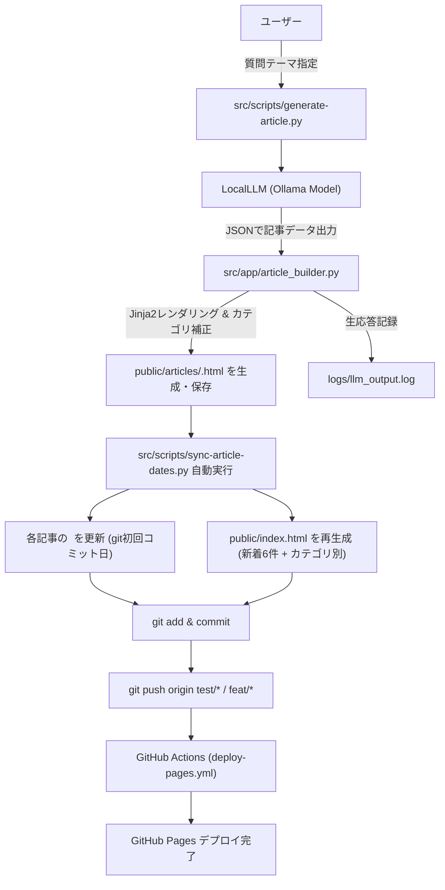
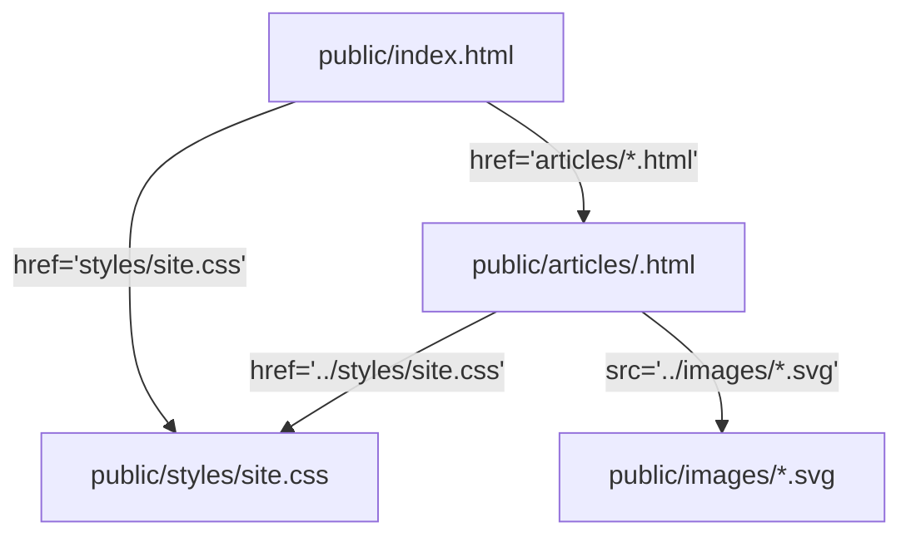

# 基本設計書（システム全体アーキテクチャ定義）
**「技術質問ノート」サイト全体システムアーキテクチャ**

| 項目 | 内容 |
| :--- | :--- |
| 文書番号 | KNB-BD-001 |
| ドキュメント名 | 基本設計書（システム全体アーキテクチャ定義） |
| 版数 | Rev.1.1 |
| 改訂日 | 2026-08-15 |
| 作成日 | 2026-06-14 |
| 作成者 | 開発チーム |

---

本ドキュメントは「技術質問ノート」サイト全体のシステム構成、データフロー、コンポーネント間の依存関係をプログラム仕様書の粒度で記述する。

## 1. システム概要

| 項目           | 内容                                                           |
| -------------- | -------------------------------------------------------------- |
| 種別           | 静的サイト（ビルドツールなし）                                 |
| ホスティング   | GitHub Pages（main ブランチ / ルート配信）                     |
| デプロイ方式   | `push → GitHub Actions → upload-pages-artifact → deploy-pages` |
| ランタイム依存 | なし（HTML/CSS/SVG のみ配信）                                  |
| 開発時依存     | Python 3（スクリプト実行）、Git（作成日取得）                  |
| 言語           | 日本語（`lang="ja"`）                                          |
| 文字コード     | UTF-8（BOM なし）、改行 LF                                     |

## 2. ディレクトリ構造と責務

```
.
├── index.html                  # エントリーポイント（スクリプト生成）
├── README.md                   # リポジトリ説明
├── AGENTS.md                   # AI エージェント向け運用ルール
├── .gitignore                  # ホワイトリスト方式（html/css/md/svg/画像のみ許可）
├── .github/
│   └── workflows/
│       └── deploy-pages.yml    # GitHub Pages デプロイワークフロー（Actions）
├── config/
│   └── category_config.json    # カテゴリ・クラスタ定義（メタデータ）
├── docs/                       # 運用・仕様ドキュメント
│   ├── KNB-BD-001_基本設計書.md                   # 本ファイル
│   ├── KNB-DD-001_詳細設計書_GitHubIssue同期.md    # GitHub Issue同期・ローカル管理仕様
│   ├── KNB-DD-002_詳細設計書_記事仕様.md             # 記事 HTML 仕様
│   ├── KNB-DD-003_詳細設計書_インデックス生成仕様.md   # index.html 生成仕様
│   ├── KNB-DD-004_詳細設計書_ホームページ仕様.md     # ホーム画面レイアウト仕様
│   ├── KNB-DD-005_詳細設計書_CSS仕様.md            # スタイルシート仕様
│   ├── KNB-DD-006_詳細設計書_Skill動作仕様.md        # Skill 動作仕様
│   ├── KNB-DD-007_詳細設計書_ローカルLLM運用仕様.md   # ローカルLLM・思考モデル運用仕様
│   ├── KNB-DS-001_データ構造仕様書_永続化データスキーマ.md # 永続化データスキーマ仕様
│   ├── TEMPLATE/               # 設計ドキュメントテンプレート・ガイドライン
│   ├── setup/
│   │   └── KNB-ENV-001_環境構築仕様書_プロジェクトセットアップ.md # 環境構築仕様書
│   └── test/
│       ├── KNB-TEST-001_テスト仕様書_単体テスト.md # 単体テスト仕様書
│       └── KNB-TEST-002_テスト仕様書_結合テスト.md # 結合テスト仕様書
├── logs/
│   └── llm_output.log          # ローカルLLMの生応答ログ
├── public/                     # 公開静的ファイルディレクトリ
│   ├── index.html              # ホーム画面エントリーポイント
│   ├── articles/               # 記事 HTML（1 ファイル = 1 質問）
│   │   ├── <slug>.html
│   │   └── template.html       # 手動作成用HTMLテンプレート
│   └── styles/
│       └── site.css            # 共通スタイルシート
├── src/                        # Pythonソースコード
│   ├── app/
│   │   ├── templates/
│   │   │   └── article_template.html # 自動生成用Jinja2テンプレート
│   │   ├── article_builder.py  # JSONデータからのHTMLビルド・カテゴリ正規化
│   │   ├── chatmodel.py        # ローカルLLM (Ollama) 接続ラッパー
│   │   └── config.py           # 環境変数・パス設定
│   └── scripts/
│       ├── generate-article.py # JSONベース技術記事自動生成スクリプト
│       └── sync-article-dates.py # 記事作成日同期・index.html再生成
└── pyproject.toml              # プロジェクト設定と依存関係（jinja2等含む）
```

## 3. データフロー



## 4. コンポーネント依存関係



- `index.html` は `styles/site.css` を直接参照（同階層）
- `articles/*.html` は `../styles/site.css` を相対パスで参照（1階層上）
- 画像は `articles/` から `../images/` で参照
- JavaScript 依存なし
- 外部 CDN 依存なし

## 5. デプロイパイプライン仕様

### ファイル: `.github/workflows/deploy-pages.yml`

| 項目                 | 値                                                  |
| -------------------- | --------------------------------------------------- |
| トリガー             | `push` to `main`, `devlop`, `feat/*`, `test/*` / `workflow_dispatch` |
| ランナー             | `ubuntu-latest`                                     |
| パーミッション       | `contents: read`, `pages: write`, `id-token: write` |
| 同時実行制御         | group `"pages"`, 進行中はキャンセルしない           |
| アーティファクト対象 | `public` ディレクトリ（`path: './public'`）         |

### ステップ

1. `actions/checkout@v4` — リポジトリチェックアウト
2. `actions/upload-pages-artifact@v3` — `public` 配下の静的ファイルをアーティファクトに格納
3. `actions/deploy-pages@v4` — GitHub Pages へデプロイ

## 6. Git 管理ポリシー

### .gitignore 方式: ホワイトリスト

デフォルトですべて無視（`*`）し、以下のみ許可:

| パターン                                                                | 用途                 |
| ----------------------------------------------------------------------- | -------------------- |
| `!*/`                                                                   | ディレクトリ走査許可 |
| `!*.html`                                                               | 記事・index          |
| `!*.css`                                                                | スタイル             |
| `!*.md`                                                                 | ドキュメント         |
| `!*.svg`                                                                | 図解                 |
| `!*.png`, `!*.jpg`, `!*.jpeg`, `!*.gif`, `!*.webp`, `!*.ico`, `!*.avif` | 画像                 |
| `!.gitignore`                                                           | 自身                 |

**意図**: `.env`、`.json`、`.py`、実行ファイルなど機密情報を含みうるファイルを一律除外し、公開リポジトリとしての安全性を確保する。

> 注意: `scripts/sync-article-dates.py` は `.py` が gitignore されているため、現状ではコミットできない。運用開始時に `!*.py` または `!scripts/*.py` の追加が必要。

## 7. セキュリティ設計

| 対策               | 実装                                                  |
| ------------------ | ----------------------------------------------------- |
| 機密情報の混入防止 | ホワイトリスト gitignore + AGENTS.md の記載禁止ルール |
| 外部スクリプト排除 | JavaScript 不使用、外部 CDN 不使用                    |
| XSS リスク         | ユーザー入力なし（静的 HTML のみ）                    |
| HTTPS              | GitHub Pages が自動適用                               |
| Content Security   | 静的配信のため追加ヘッダ設定なし（Pages デフォルト）  |

## 8. レスポンシブ設計

| ブレークポイント | 対象                                      |
| ---------------- | ----------------------------------------- |
| > 900px          | デスクトップ（新着3列、横長カード横並び） |
| 721px–900px      | タブレット（新着2列、カード折り返し）     |
| ≤ 720px          | スマホ（1列、縦積み、ナビピル化）         |

## 9. 拡張時の影響範囲

| 変更         | 影響するファイル                                                                                   |
| ------------ | -------------------------------------------------------------------------------------------------- |
| 記事追加     | `articles/<slug>.html`, `scripts/sync-article-dates.py`（ARTICLE_CLUSTER）, `index.html`（再生成） |
| カテゴリ追加 | `scripts/sync-article-dates.py`（CLUSTERS, CLUSTER_ORDER）, `index.html`（再生成）                 |
| スタイル変更 | `styles/site.css`（全ページに影響）                                                                |
| 図解追加     | `images/<name>.svg`, 対応する `articles/<slug>.html`                                               |
| 新着件数変更 | `scripts/sync-article-dates.py`（RECENT_LIMIT）, `index.html`（再生成）                            |

---

## 10. 改訂履歴 (Change Log)

| 版数 | 改訂日 | 変更者 | 変更内容・変更理由 (Why) |
| :--- | :--- | :--- | :--- |
| Rev.1.0 | 2026-08-13 | 開発チーム | TEMPLATEに準拠したドキュメント構造化およびフォーマット標準化 |
| Rev.1.1 | 2026-08-15 | 開発チーム | 自由形式Markdown変換アーキテクチャおよびStage 0.5〜5引用アンカー自動連携仕様を追加 |
