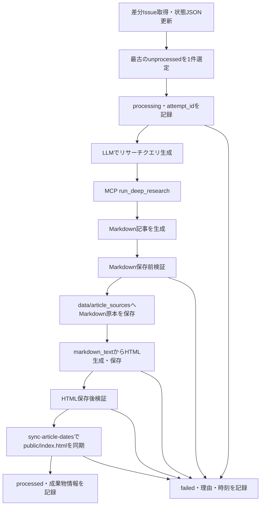

# 詳細設計書（GitHub Issue同期・ローカル管理仕様）
| 項目     | 内容       |
| :------- | :--------- |
| 文書番号 | KNB-DD-001 |
| 版数     | Rev.1.4    |
| 改訂日   | 2026-09-03 |

## 1. 基本方針
GitHub Issueは読み取り専用で取得し、処理状況は`data/issue_status.json`に管理する。1実行サイクルは最古の`unprocessed`を最大1件処理する。記事同期の正規入力はJSONではなくMarkdownであり、Markdown原本を保存してからHTMLを生成する。

## 2. 処理フロー

現実装では原本、HTML、JSON状態、indexの保存に原子的書込みを利用する。indexは保存後に再読込み・検証し、検証失敗時は保存前内容へ復元する。同期統合テストでオーケストレーションと状態記録を検証する。

## 3. MCP連携
1. ChatModelがIssueから検索クエリを生成する。
2. SSE接続のMCP `run_deep_research`を最大1800秒で呼び出す。接続・実行失敗時はIssue本文だけをリサーチ結果としてフォールバックする。
3. ChatModelにMarkdownのみを要求する。外側の`markdown`/`md`コードフェンスは除去する。
4. `validate_markdown`成功後に原本を保存し、`ArticleBuilder.save_article({"markdown_text": markdown_text}, filename)`でHTMLを生成する。`validate_html`成功後にindex同期する。
旧JSON修復の`repair_truncated_json`および記事JSON生成・解析経路は撤去済みであり、同期フローはMarkdown入力だけを受け付ける。

## 4. 状態情報
| フィールド                     | 意味                                                             |
| :----------------------------- | :--------------------------------------------------------------- |
| `status`                       | `unprocessed`、`processing`、`processed`、`failed`               |
| `article_source_file`          | 保存済みMarkdown原本のファイル名。未作成時は`null`。             |
| `article_file`                 | 生成済みHTMLのファイル名。未作成時は`null`。                     |
| `index_synced`                 | index同期完了として記録した値。`false`は未同期または失敗を示す。 |
| `attempt_id`                   | 処理試行のUUID。未試行・調査のみは`null`。                       |
| `failed_at` / `failure_reason` | 失敗時刻と、秘密情報を含めない段階・要約。                       |

`processed`は現実装でHTML検証とindex同期の成功後に設定する。indexは原子的に保存され、保存後検証の失敗時は保存前内容へ復元する。`failed`は自動で`unprocessed`へ戻さない。運用者が成果物・失敗理由を確認し、対象Issueの再試行を明示承認した場合だけ`unprocessed`へ変更して再試行できる。

## 5. 後方互換性と運用
過去のIssueレコードに追加状態フィールドがなければ、読取り時は`article_source_file`、`attempt_id`、`failed_at`、`failure_reason`を`null`、`index_synced`を`false`として扱う。#11/#13は成果物と実行履歴が確認できないため`failed`を維持し、再試行は未承認である。

## 6. 改訂履歴
| 版数    | 改訂日     | 変更内容                                                                            |
| :------ | :--------- | :---------------------------------------------------------------------------------- |
| Rev.1.2 | 2026-08-15 | 文書間整合性レビュー反映                                                            |
| Rev.1.3 | 2026-08-31 | Markdown原本、前後検証、index同期、状態フィールド、failed再試行制約を実装実態へ更新 |
| Rev.1.4 | 2026-09-03 | index原子性・保存後検証・失敗時復元と、FEAT-04統合テストの検証範囲を反映            |
