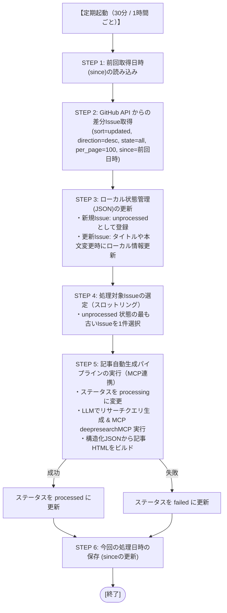

# 詳細設計書（GitHub Issue同期・ローカル管理仕様）
**GitHub Issue 取得・ローカル管理・MCP連携制御仕様**

| 項目 | 内容 |
| :--- | :--- |
| 文書番号 | KNB-DD-001 |
| ドキュメント名 | 詳細設計書（GitHub Issue同期・ローカル管理仕様） |
| 版数 | Rev.1.0 (初版制定) |
| 改訂日 | 2026-08-13 |
| 作成日 | 2026-06-16 |
| 作成者 | 開発チーム |

---

本ドキュメントは、指定したGitHubリポジトリからIssueを取得し、その情報を元にした自動記事生成のトリガー制御、および処理状況のローカル管理を行うシステムの詳細設計を定義する。

## 1. 目的と基本方針

- **目的**: GitHub上のIssueを記事自動生成のインプット（要件定義/質問）として安全にローカルに読み込み、自動実行パイプラインのトリガーとする。
- **Issue側の非干渉（編集禁止）**: 外部APIトークンへの追加権限要求を避けるため、GitHub上のIssue状態（Close、ラベル、コメントなど）は変更せず、すべてローカルで処理状況を管理する。
- **処理スロットリング**: 重いLLMやDeep Researchの処理を集中させないため、1回の定期実行サイクルにつき**最大1件のみ**未処理のIssueをピックアップして処理する。
- **最小通信量**: `since` パラメータを使用した差分取得により、API消費量を最小化する。

---

## 2. 処理フロー



---

## 3. GitHub API パラメータ仕様

Issueをフェッチする際のAPIエンドポイントおよびクエリパラメータの仕様。

- **エンドポイント**: `GET /repos/{owner}/{repo}/issues`
- **ヘッダー**: `Accept: application/vnd.github+json`, `Authorization: Bearer <TOKEN>`
- **クエリパラメータ**:

| パラメータ | 設定値 | 役割 |
| :--- | :--- | :--- |
| `sort` | `updated` | 更新日時順にソートする |
| `direction` | `desc` | 更新の新しい順（降順）に取得する |
| `state` | `all` | Open（解決前）および Close（解決済）のすべてのIssueを対象とする |
| `per_page` | `100` | 1リクエストで取得する最大件数。ページ送り回数を抑える |
| `since` | `YYYY-MM-DDTHH:MM:SSZ` | 指定日時以降に更新のあったIssueのみを差分取得する（インクリメンタル） |

---

## 4. ローカル状態管理の仕様

GitHub上のIssueを書き換えないため、処理状況はローカルのJSONデータベースで一元管理する。

### 4.1 管理ファイル配置
- 配置パス: `data/issue_status.json` (未存在時は初期化時に自動作成)

### 4.2 JSON スキーマ
```json
{
  "last_sync_at": "2026-06-15T21:40:00Z",
  "issues": {
    "12": {
      "number": 12,
      "title": "MCPトランスポートのセキュリティ脆弱性について",
      "body": "本文...",
      "state": "open",
      "status": "processed",
      "processed_at": "2026-06-15T21:42:00Z",
      "article_file": "mcp-transport-security.html"
    },
    "13": {
      "number": 13,
      "title": "KIROのAgent Hooks設定について",
      "body": "本文...",
      "state": "open",
      "status": "unprocessed",
      "processed_at": null,
      "article_file": null
    }
  }
}
```

### 4.3 状態（`status`）定義
- `unprocessed` (未処理): 取得されローカルに登録された初期状態。
- `processing` (処理中): 現在記事生成パイプラインが実行中の状態。
- `processed` (処理完了): 記事が正常にビルド・インデックス同期された状態。
- `failed` (エラー・処理失敗): 生成処理中にエラーが発生し、処理が中断された状態。

---

## 5. 定期実行とスロットリングの仕様

### 5.1 実行周期
- 30分または1時間周期でタスクを定期ポーリング実行する。
- 実行には `cron` または定期タスクランナー（Pythonスクリプトによるループ＋sleep、あるいはシステムタスクスケジュール）を用いる。

### 5.2 スロットリング制御 (1回につき1件のみ)
`data/issue_status.json` 内を検索し、状態が `unprocessed` となっているIssueの中で、**最もIssue番号が若い（＝作成されたのが古い）**Issueを1件だけ操作対象とする。
これにより、複数のIssueが一度に届いた場合でも、APIやローカルリソースを枯渇させることなく、30分/1時間のサイクルごとに順番に処理を行う。

---

## 6. MCP Deep Research 連携の仕様

### 6.1 環境変数
MCPサーバーとのSSE接続には以下の環境変数を使用する。

- **`KNOWAGE_BANK_DEEPRESEARCH_SSE_URL`**: Deep Research MCPサーバーが提供するSSE接続用エンドポイント（デフォルト: `http://localhost:8000/sse`）。

### 6.2 実行プロセスと例外設計
1. **リサーチクエリの抽出**: 
   - LLM（ChatModel）を呼び出し、Issueの「タイトル」および「本文」からDeep Research用リサーチクエリ（検索エンジンに投げるための自然言語質問文）を生成する。
2. **MCP連携 (run_deep_researchの呼び出し)**:
   - `sse_client` で接続を確立し、`run_deep_research` ツールを実行。
   - ネットワーク遮断やサーバー未起動などの理由でMCP接続に失敗、または処理タイムアウト（1800秒）が発生した場合は、リサーチ結果を空としてフォールバック処理を実行するか、もしくはエラーとしてステータスを `failed` にする。
3. **最終記事の構造化JSON生成**:
   - 得られたリサーチ結果テキストをコンテキストに含め、最終的なHTML構造化用JSONを生成。

---

## 7. 改訂履歴 (Change Log)

| 版数 | 改訂日 | 変更者 | 変更内容・変更理由 (Why) |
| :--- | :--- | :--- | :--- |
| Rev.1.0 | 2026-08-13 | 開発チーム | TEMPLATEに準拠したドキュメント構造化およびフォーマット標準化（github-issue-sync.mdより移行） |
