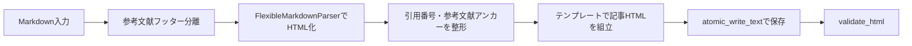

# 詳細設計書（記事 HTML 仕様）
| 項目     | 内容       |
| :------- | :--------- |
| 文書番号 | KNB-DD-002 |
| 版数     | Rev.1.3    |
| 改訂日   | 2026-08-31 |

## 1. 入出力契約
同期処理の記事入力はJSONではなくMarkdownである。LLMが返したMarkdownは保存前検証を通過した後に`data/article_sources/issue-<番号>.md`へ保存され、`ArticleBuilder`には`{"markdown_text": markdown_text}`として渡される。HTMLは`public/articles/<slug>.html`へUTF-8（BOMなし）・LFで原子的に保存される。保存済み原本からは外部LLM・MCPを呼ばずにHTMLを再生成できる。

## 2. HTML出力構造
出力は`<!doctype html>`、`<html lang="ja">`、`<title>`、`<main>`または`<article>`を含む。テンプレートはサイトヘッダー、ヒーロー（`eyebrow`、`h1`、`lead`、作成日）、Q&A、本文、要点、参考文献、関連ナビゲーション、フッターを組み立てる。記事内のスタイルシート参照は`../styles/site.css`、indexへの戻り先は`../index.html`である。

## 3. Markdown変換フロー

Markdown中の`title`、`eyebrow`、`lead`、Q&A、要点、本文、参考文献はパーサーとテンプレートで利用する。引用番号は出現順へ振り直し、参考文献は`ref-N`アンカーを持つリストとして出力される。

## 4. 現実装の検証範囲
| 対象     | 実装済み                                                                                                                |
| :------- | :---------------------------------------------------------------------------------------------------------------------- |
| Markdown | 空入力、未閉鎖コードフェンス、危険HTMLタグ・イベント属性、H4以降、MarkdownリンクのHTTPS・資格情報・制御文字を検証する。 |
| HTML     | DOCTYPE、`lang="ja"`、`title`、`main`または`article`、`href`のHTTPS性を検証する。                                       |
| 保存     | HTMLは原子的書込みを使う。同期処理はHTML保存後に再読込して検証する。                                                    |

frontmatter必須項目、見出しの連続性、ネストリスト、引用ブロック、画像、Mermaid、表、引用と参考文献の完全整合を包括的に検出・拒否する検証は未対応である。したがって未対応構文の安全な受理を保証しない。仕様として拒否が必要な構文は、検証器の拡張が完了するまで追跡事項とする。

## 5. リンクの現実の扱い
外部リンクはHTTPS絶対URLでなければならない。一方、現実装の検証器は内部アンカー（`#`）と`/`、`./`、`../`で始まる相対リンクを許可する。これは記事の`../styles/site.css`および`../index.html`参照と整合する。相対リンクの到達先存在確認や公開範囲の検証は実装していない。

## 6. 非対象・追跡事項
記事JSON生成・修復経路は撤去済みで、記事同期・手動記事生成・MCP記事生成はMarkdownだけを入力として扱う。indexの原子的書込みと保存後検証・検証失敗時の復元は実装済みである。原本再読込による内容一致検証は本仕様の未完了項目として追跡する。

## 7. 改訂履歴
| 版数    | 改訂日     | 変更内容                                                                                      |
| :------ | :--------- | :-------------------------------------------------------------------------------------------- |
| Rev.1.2 | 2026-08-15 | 文書間整合性レビュー反映                                                                      |
| Rev.1.3 | 2026-08-31 | Markdown原本・`markdown_text`入力・実装済み検証範囲・未対応構文・相対リンクの扱いを実態へ更新 |
