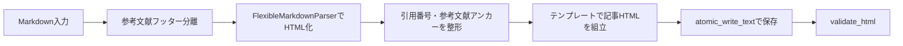

# 詳細設計書（記事 HTML 仕様）
| 項目     | 内容       |
| :------- | :--------- |
| 文書番号 | KNB-DD-002 |
| 版数     | Rev.1.4    |
| 改訂日   | 2026-09-02 |

## 1. 入出力契約
同期処理の記事入力はJSONではなくMarkdownである。LLMが返したMarkdownは保存前検証を通過した後に`data/article_sources/issue-<番号>.md`へ保存され、`ArticleBuilder`には`{"markdown_text": markdown_text}`として渡される。HTMLは`public/articles/<slug>.html`へUTF-8（BOMなし）・LFで原子的に保存される。保存済み原本からは外部LLM・MCPを呼ばずにHTMLを再生成できる。

## 2. HTML出力構造
出力は`<!doctype html>`、`<html lang="ja">`、`<title>`、`<main>`または`<article>`を含む。テンプレートはサイトヘッダー、ヒーロー（`eyebrow`、`h1`、`lead`、作成日）、Q&A、本文、要点、参考文献、関連ナビゲーション、フッターを組み立てる。記事内のスタイルシート参照は`../styles/site.css`、indexへの戻り先は`../index.html`である。

## 3. Markdown変換フロー

Markdown中の`title`、`eyebrow`、`lead`、Q&A、要点、本文、参考文献はパーサーとテンプレートで利用する。引用番号は出現順へ振り直し、参考文献は`ref-N`アンカーを持つリストとして出力される。

## 4. Markdown保存前検証契約
Markdownは先頭と終端が`---`で囲まれたfrontmatterを持ち、`title`、`eyebrow`、`lead`をそれぞれ非空の値で必須とする。重複キー、値のないキー、frontmatter外のH1を拒否する。

| 分類           | 許可する構文                                                                                   | 拒否する構文                                                                      |
| :------------- | :--------------------------------------------------------------------------------------------- | :-------------------------------------------------------------------------------- |
| ブロック       | H2/H3、単階層の箇条書き・番号付きリスト、パイプ表、通常のコードフェンス、Mermaidコードフェンス | H1、H4以降、ネストリスト、引用ブロック、タスクリスト、画像、脚注、生HTML          |
| インライン     | 太字、インラインコード、HTTPSリンク、許可範囲内の相対リンク                                    | HTTP・資格情報付き・制御文字を含むURL、未許可の相対リンク                         |
| 引用・参考文献 | 本文の`[N]`または`[N, M]`と、末尾に連続配置する`[N] 題名` / `URL: https://...`                 | 未定義引用、未引用参考文献、重複番号、不正URL、途中に別本文を含む参考文献フッター |

閉鎖済みコードフェンス内は、Markdown構文および引用検証の対象外とする。HTML出力はDOCTYPE、`lang="ja"`、`title`、`main`または`article`、`href`の安全性を検証する。

## 5. 相対リンクの扱い
Markdown本文で許可する相対リンクは、空白・制御文字を含まない内部アンカー、`/articles/<ファイル名>.html`、`./<ファイル名>.html`、`../articles/<ファイル名>.html`に限る。パストラバーサル、任意のルート相対パス、CSSなど記事以外への相対リンクは拒否する。HTMLテンプレートの`../styles/site.css`および`../index.html`はMarkdown入力ではなくテンプレートが生成するリンクであり、HTML検証では既存どおり許可する。

## 6. 非対象・追跡事項
記事JSON生成・修復経路は撤去済みで、記事同期・手動記事生成・MCP記事生成はMarkdownだけを入力として扱う。indexの原子的書込みと保存後検証・検証失敗時の復元は実装済みである。原本保存後の再読込・内容一致検証(OUT-03)も実装済みである。

## 7. 改訂履歴
| 版数    | 改訂日     | 変更内容                                                                                      |
| :------ | :--------- | :-------------------------------------------------------------------------------------------- |
| Rev.1.2 | 2026-08-15 | 文書間整合性レビュー反映                                                                      |
| Rev.1.3 | 2026-08-31 | Markdown原本・`markdown_text`入力・実装済み検証範囲・未対応構文・相対リンクの扱いを実態へ更新 |
| Rev.1.4 | 2026-09-02 | FEAT-03のfrontmatter、許可・拒否構文、引用・参考文献、相対リンクの検証契約を追加              |
| Rev.1.5 | 2026-09-05 | 原本保存後の再読込・内容一致検証(OUT-03)の実装完了を反映                                      |
