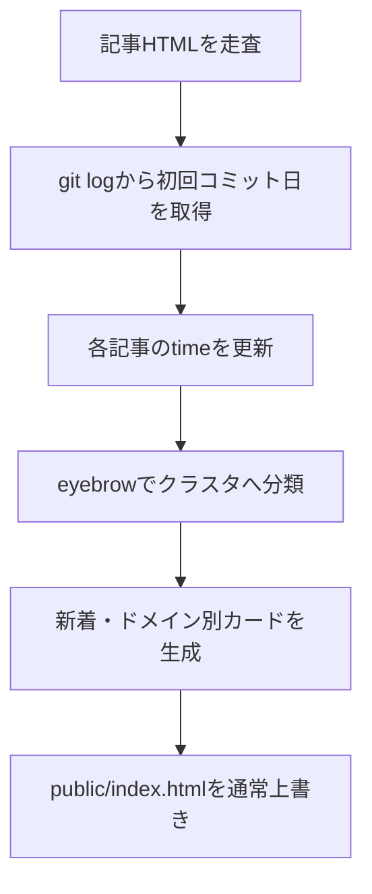

# 詳細設計書（index.html 生成仕様）
| 項目     | 内容       |
| :------- | :--------- |
| 文書番号 | KNB-DD-003 |
| 版数     | Rev.1.2    |
| 改訂日   | 2026-08-31 |

## 1. 入出力
`src/scripts/sync-article-dates.py`は`public/articles/*.html`、Gitの初回コミット日、`config/category_config.json`を入力とし、各記事の`<time>`と`public/index.html`を更新する。indexは手編集せず、同期スクリプトのテンプレートと記事HTMLから再生成する。

## 2. カード情報と分類
記事の`h1`、`.lead`、`.eyebrow`、ファイル名、初回コミット日からカードを作る。`.eyebrow`を`category_config.json`のクラスタ定義へ照合し、新着は上位6件、ドメイン内のクラスタ・記事は作成日降順に表示する。未定義のeyebrowまたはGit履歴がない記事は警告・スキップまたは日付フォールバックの対象となる。

## 3. 処理フロー

Issue同期から呼び出す場合は、Markdown保存・HTML保存後のこの処理でindexを同期し、その後にIssue状態の`index_synced=true`を記録する。

## 4. 保存・検証の現状
`public/index.html`は現状、通常の上書きで保存する。`atomic_write_text`は利用しておらず、index保存後に記事リンク、タイトル、日付、重複を再読込して検証する処理もない。これらは既存のJSON・Markdown・記事HTMLの原子的書込みと異なり、実装済み要件ではなく追跡事項である。

| 追跡事項          | 完了条件                                                                                  |
| :---------------- | :---------------------------------------------------------------------------------------- |
| index原子的書込み | 一時ファイル、flush・fsync、`os.replace`により旧indexを破壊しない。                       |
| 保存後検証        | 保存済みindexのリンク、カード題名、日付、重複を検証し、失敗時の状態記録と補償を定義する。 |
| 統合テスト        | HTML・index・Issue状態を通した成功および失敗段階を検証する。                              |

## 5. 改訂履歴
| 版数    | 改訂日     | 変更内容                                                                    |
| :------ | :--------- | :-------------------------------------------------------------------------- |
| Rev.1.1 | 2026-08-15 | 文書間整合性レビュー反映                                                    |
| Rev.1.2 | 2026-08-31 | indexが通常上書きである実態と、原子的書込み・保存後検証を追跡事項として更新 |
