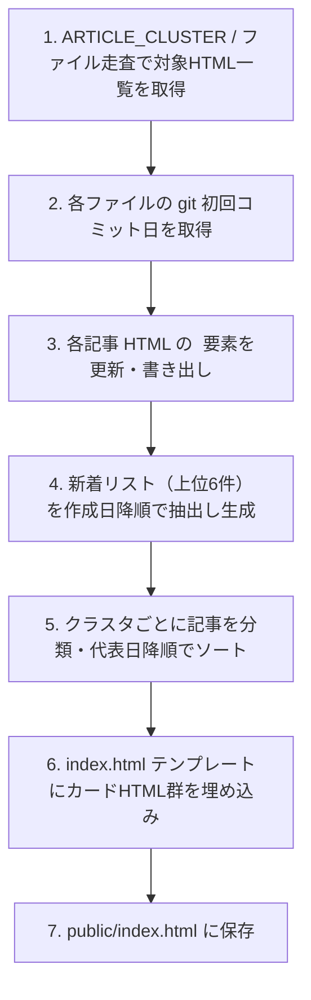

# 詳細設計書（index.html 生成仕様）
**インデックス自動生成・クラスタマッピング・日付同期仕様**

| 項目 | 内容 |
| :--- | :--- |
| 文書番号 | KNB-DD-003 |
| ドキュメント名 | 詳細設計書（index.html 生成仕様） |
| 版数 | Rev.1.0 (初版制定) |
| 改訂日 | 2026-08-13 |
| 作成日 | 2026-06-14 |
| 作成者 | 開発チーム |

---

本ドキュメントは `scripts/sync-article-dates.py` によって生成・更新される `index.html` の構造仕様と、スクリプトの設計仕様を定義する。

## 1. 概要

| 項目     | 値                                               |
| -------- | ------------------------------------------------ |
| 生成対象 | `public/index.html`（public直下）                 |
| 生成主体 | `scripts/sync-article-dates.py`                  |
| 入力     | `public/articles/*.html` + Git ログ + スクリプト内定数  |
| 副作用   | 各 `public/articles/*.html` の `<time datetime>` も更新 |
| 手編集   | 原則禁止（次回スクリプト実行で上書きされる）     |

## 2. index.html ページ構造

### セクション構成（上から順）

| #   | セクション     | ID / クラス       | 内容                    |
| --- | -------------- | ----------------- | ----------------------- |
| 1   | サイトヘッダー | `.site-header`    | ブランド + カテゴリナビ |
| 2   | ヒーロー       | `.hero.home-hero` | サイト説明              |
| 3   | 分類マップ     | `.section-map`    | カテゴリアンカーカード  |
| 4   | 新着           | `#recent`         | 直近6件のカード         |
| 5   | 開発           | `#dev`            | クラスタ別横長カード    |
| 6   | ゲーム         | `#game`           | クラスタ別横長カード    |
| 7   | AI             | `#ai`             | クラスタ別横長カード    |
| 8   | インフラ       | `#infra`          | クラスタ別横長カード    |
| 9   | フッター       | `.site-footer`    | 追加方法の案内          |

## 3. ドメイン（大カテゴリ）定義

| ドメインID | ナビ表示 | eyebrow  | h2                                   |
| ---------- | -------- | -------- | ------------------------------------ |
| `dev`      | 開発     | 開発     | ソフトウェアを作る・配布する・支える |
| `game`     | ゲーム   | ゲーム   | ゲーム制作の環境選び                 |
| `ai`       | AI       | AI       | AI を使う・作る・理解する・守る      |
| `infra`    | インフラ | インフラ | クラウドとネットワーク               |

## 4. クラスタ（サブカテゴリ）定義

外部設定ファイル `config/category_config.json` で管理する。

| クラスタID           | ドメイン | eyebrow パス                 | h3 見出し                                            |
| -------------------- | -------- | ---------------------------- | ---------------------------------------------------- |
| `dev-backend`        | dev      | 開発 > バックエンド & API    | サーバー側フレームワークと API 設計                  |
| `dev-frontend`       | dev      | 開発 > フロントエンド & 配信 | 画面、ルーティング、ホスティング、メディア出力       |
| `dev-toolchain`      | dev      | 開発 > 開発基盤              | 言語、ランタイム、パッケージ、リポジトリ、品質ツール |
| `game-engine`        | game     | ゲーム > エンジン            | 3D エンジンの比較と選定                              |
| `ai-governance`      | ai       | AI > 安全・運用              | 企業利用、リスク、ガバナンス                         |
| `ai-articles-papers` | ai       | AI > 記事・論文              | 記事・論文の読み解き                                 |
| `ai-workflow`        | ai       | AI > 開発ワークフロー        | コーディング支援、ツール連携、作業の自動化           |
| `ai-app`             | ai       | AI > アプリケーション設計    | RAG、Agent、データと検索の設計                       |
| `ai-foundation`      | ai       | AI > 基礎                    | モデルの仕組みと論文                                 |
| `infra-cloud`        | infra    | インフラ > クラウド（AWS）   | VPC、データベース、可用性                            |
| `infra-network`      | infra    | インフラ > ネットワーク      | 接続とセキュリティ（クラウド外も含む）               |

## 5. 記事→クラスタ マッピング（自動判定）

静的な対照表は廃止され、各記事 HTML の `<p class="eyebrow">` に記述されているカテゴリ名（タグ名）と、上記クラスタ定義の `eyebrow` とをスクリプト実行時に自動一致判定してクラスタIDを動的解決します。

- 例: `go-backend-api-frameworks.html` 内に `<p class="eyebrow">開発 > バックエンド & API</p>` がある場合 ➔ 自動的に `dev-backend` クラスタへマッピングされます。
- HTMLエンティティのエスケープ表記（`&gt;`, `&amp;`）や空白の有無の揺らぎについても自動的に補正されます。


## 6. 並び順アルゴリズム

### 6.1 新着セクション

1. 全記事の作成日（git 初回コミット日）を取得
2. 作成日の降順でソート
3. 上位 `RECENT_LIMIT`（デフォルト: 6）件を抽出
4. `.article-card` 形式で出力

### 6.2 カテゴリ別セクション

#### ドメイン内のクラスタ順序

スクリプト内 `CLUSTER_ORDER` リストで各ドメインに属するクラスタの表示順を定義。ただし動的ソートも行う:

1. 各クラスタ内の記事を作成日降順でソート
2. クラスタの「代表日」= そのクラスタ内最新記事の作成日
3. 同一ドメイン内のクラスタを代表日降順で並べる

#### クラスタ内の記事順序

- 同一クラスタ内: 作成日降順

## 7. 作成日の取得ロジック

```python
def get_creation_date(filepath):
    """git log --follow --reverse で最初のコミット日を取得"""
    result = subprocess.run(
        ["git", "log", "--follow", "--reverse", "--format=%aI", "--", filepath],
        capture_output=True, text=True
    )
    lines = result.stdout.strip().splitlines()
    if lines:
        return parse_iso_date(lines[0])  # 最古のコミット日
    return None  # 未コミットファイル
```

| 仕様             | 詳細                                                     |
| ---------------- | -------------------------------------------------------- |
| コマンド         | `git log --follow --reverse --format=%aI -- {path}`      |
| `--follow`       | リネーム（`programming/` → `articles/`）を追跡           |
| `--reverse`      | 古い順にし、先頭行 = 初回コミット                        |
| `--format=%aI`   | Author Date を ISO 8601 で出力                           |
| 未コミットの扱い | `None`（index に含めないか、今日の日付をフォールバック） |

## 8. 記事 HTML の日付更新ロジック

スクリプトは各記事の以下のパターンを書き換える:

```html
<!-- 対象パターン -->
<p class="article-created"><time datetime="YYYY-MM-DD">作成日: YYYY年M月D日</time></p>
```

置換ロジック:
1. 正規表現で `<time datetime="...">作成日: ...</time>` をマッチ
2. git から取得した日付で `datetime` 属性と表示テキストを更新
3. ファイルを上書き保存

## 9. index.html カード生成テンプレート

### 9.1 新着カード

```html
<a class="article-card" href="articles/{slug}.html">
  <p class="card-meta-row">
    <time class="article-date" datetime="{YYYY-MM-DD}">{YYYY}年{M}月{D}日</time>
    <span class="eyebrow">{eyebrow}</span>
  </p>
  <h4>{title}</h4>
  <p>{description}</p>
  <span class="meta">{meta}</span>
</a>
```

### 9.2 横長カード

```html
<a class="article-row" href="articles/{slug}.html">
  <div class="article-row-aside">
    <time class="article-date" datetime="{YYYY-MM-DD}">{YYYY}年{M}月{D}日</time>
    <span class="article-row-eyebrow">{eyebrow}</span>
  </div>
  <div class="article-row-main">
    <span class="article-row-title">{title}</span>
    <p class="article-row-desc">{description}</p>
  </div>
  <span class="article-row-meta">{meta}</span>
</a>
```

### 9.3 カードデータの取得元

| フィールド    | 取得方法                                     |
| ------------- | -------------------------------------------- |
| `slug`        | ファイル名（拡張子除去）                     |
| `YYYY-MM-DD`  | git 初回コミット日                           |
| `eyebrow`     | 記事 HTML の `.eyebrow` テキスト             |
| `title`       | 記事 HTML の `<h1>` テキスト                 |
| `description` | 記事 HTML の `.lead` テキスト                |
| `meta`        | 記事 HTML のメタ情報（手動定義 or 自動生成） |

## 10. スクリプト実行仕様

### コマンド

```bash
python3 scripts/sync-article-dates.py
```

### 前提条件

- カレントディレクトリ = リポジトリルート
- Git リポジトリが初期化済み
- 対象記事が 1 回以上コミットされている

### 処理フロー



### 出力

- `public/index.html`（上書き）
- `public/articles/*.html`（`<time>` 要素のみ更新）

### エラーハンドリング

| 状況                                                | 挙動                                         |
| --------------------------------------------------- | -------------------------------------------- |
| HTML 内の eyebrow が `category_config.json` に未定義 | 警告を出してスキップ                         |
| git コミット履歴がない                              | 警告。日付なしまたは今日日付でフォールバック |

## 11. 定数一覧

| 定数名            | デフォルト値 | 説明                                                       |
| ----------------- | ------------ | ---------------------------------------------------------- |
| `RECENT_LIMIT`    | `6`          | 新着セクションに表示する件数                               |
| `CLUSTERS`        | 辞書 (JSON)  | クラスタIDとメタ情報                                       |
| `CLUSTER_ORDER`   | リスト (JSON)| ドメイン内のクラスタ表示順（動的ソート前のフォールバック） |

## 12. index.html の静的部分

以下はスクリプトが毎回同じ内容で出力する固定部分:

- `<head>` セクション全体
- `.site-header`（ブランド + ナビ）
- `.hero.home-hero`（サイト説明）
- `.section-map`（分類マップ）
- ドメインセクションの見出し部分
- `.site-footer`

## 13. 手動で index.html を変更したい場合

スクリプト実行で上書きされるため、以下のいずれかで対応:

1. スクリプトのテンプレート定数を編集 → 再実行
2. カード文言を変えたい → 記事 HTML の `.lead` や `h1` を修正 → 再実行
3. 固定テキスト変更 → スクリプト内の HTML テンプレート文字列を修正

## 14. 運用上の注意

- `index.html` と記事の日付が不一致な場合はスクリプト再実行で解消する
- 新しいクラスタを追加する場合は `config/category_config.json` の `clusters` と `cluster_order` の両方を更新する
- ドメインを追加する場合はスクリプトのテンプレートにセクション HTML を追加する
- スクリプトは冪等（何度実行しても同じ結果）であるべき

---

## 15. 改訂履歴 (Change Log)

| 版数 | 改訂日 | 変更者 | 変更内容・変更理由 (Why) |
| :--- | :--- | :--- | :--- |
| Rev.1.0 | 2026-08-13 | 開発チーム | TEMPLATEに準拠したドキュメント構造化およびフォーマット標準化（index-generation-spec.mdより移行） |
