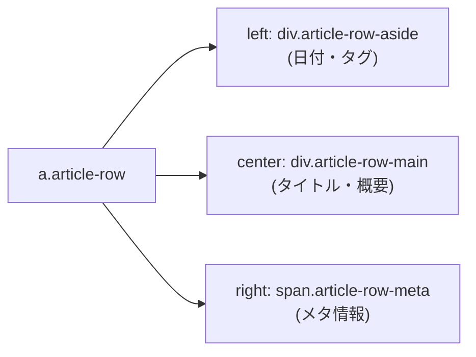

# 詳細設計書（ホームページレイアウト・表示仕様）
**トップページ UI コンポーネント・レイアウト構成・運用仕様**

| 項目           | 内容                                           |
| :------------- | :--------------------------------------------- |
| 文書番号       | KNB-DD-004                                     |
| ドキュメント名 | 詳細設計書（ホームページレイアウト・表示仕様） |
| 版数           | Rev.1.1                                        |
| 改訂日         | 2026-08-15                                     |
| 作成日         | 2026-06-14                                     |
| 作成者         | 開発チーム                                     |

---

トップページ `public/index.html` は **手書きせず**、原則として `src/scripts/sync-article-dates.py` の生成結果を正とします。カテゴリ分けはフォルダではなく UI のみで行います。

> **本書の位置づけ**: KNB-DD-003（インデックス生成仕様）がスクリプトの内部アルゴリズム・生成ロジックを定義するのに対し、本書はトップページの **UI/UX 観点でのレイアウト構成・表示ルール・運用手順** を補足する。ドメイン定義や並び順の技術的な詳細は KNB-DD-003 を正とする。

## 1. ファイルの役割

| パス                                | 役割                                               |
| ----------------------------------- | -------------------------------------------------- |
| `public/index.html`                 | ホーム。記事一覧・カテゴリ・新着（スクリプト生成） |
| `public/articles/*.html`            | 各質問ノート本文                                   |
| `public/styles/site.css`            | 共通スタイル（新着カード・横長カード行など）       |
| `src/scripts/sync-article-dates.py` | 作成日同期・index 再生成                           |

## 2. ページ構成（上から順）

1. **ヒーロー** — サイトの説明
2. **分類マップ** — 新着・開発・ゲーム・AI・インフラへのアンカー
3. **新着**（`#recent`）— 直近 **6 件**、作成日の新しい順、**カード形式**
4. **カテゴリ別一覧** — 開発 / ゲーム / AI / インフラ、各ドメイン内はサブカテゴリごとに **横長カード行**

## 3. 大カテゴリ（ドメイン）

| ID      | ナビ表示 | 内容                                                |
| ------- | -------- | --------------------------------------------------- |
| `dev`   | 開発     | フロントエンド・配信 / バックエンド・API / 開発基盤 |
| `game`  | ゲーム   | エンジン選定                                        |
| `ai`    | AI       | 開発ワークフロー / アプリ設計 / 基礎 / 安全・運用   |
| `infra` | インフラ | クラウド（AWS）/ ネットワーク                       |

サブカテゴリ（クラスタ）の定義は `config/category_config.json` を参照してください。

## 4. 並び順のルール

- **新着**: 全記事のうち git 初回コミット日が新しい **6 件** のみ
- **カテゴリ内の各リスト**: 同じサブカテゴリ内で作成日 **降順**
- **サブカテゴリブロック**: そのブロック内の最新記事の日付が新しい順（新しいブロックほど上）

## 5. 作成日の定義

- 記事ページ・index の日付は、**その HTML ファイルの git 初回コミット日**（`git log --follow --reverse`）
- 旧パス（`programming/` など）から `articles/` へ移したファイルも `--follow` で追跡
- 記事ヒーロー直下: `<p class="article-created"><time datetime="YYYY-MM-DD">作成日: YYYY年M月D日</time></p>`

## 6. UI パターン

### 新着 — `article-card`

- 3 列グリッド（タブレット 2 列、スマホ 1 列）
- 日付 + タグ（`card-meta-row`）、タイトル（`h4`）、概要、メタ行

### カテゴリ別 — `article-row`（横長カード）

1 行 = 1 記事の独立カード。構造は次のとおり。

```html
<a class="article-row" href="articles/….html">
  <div class="article-row-aside">   <!-- 左: 日付・タグ -->
  <div class="article-row-main">    <!-- 中央: タイトル・概要 -->
  <span class="article-row-meta">   <!-- 右: メタ（狭い画面では下段） -->
</a>
```



- タイトルは中央カラムに幅を確保し、細い列での不自然な折り返しを避ける
- スタイルの詳細は `public/styles/site.css` の `.article-row*` を参照

## 7. 記事を追加するときの手順

1. `public/articles/<slug>.html` を追加（既存記事と同じ HTML 構成。タグ `<p class="eyebrow">` に登録したいカテゴリ名を正しく記述）
2. 必要なら `config/category_config.json` の `clusters` / `cluster_order` を更新（新しいサブカテゴリを定義するときのみ）
3. リポジトリルートで実行:

```bash
python3 src/scripts/sync-article-dates.py
```

4. `public/index.html` と全記事の作成日が更新されることを確認

`public/index.html` を手で直した場合、次回スクリプト実行で上書きされます。カードの文言や内容を変えたいときは、各記事 HTML の `h1` や `.lead` を編集してスクリプトを再実行してください。

## 8. 変更してはいけないこと（運用上）

- トピック別サブディレクトリ（`programming/` など）に記事を分けない — 記事は **`public/articles/` のみ**
- ホームのカテゴリをフォルダ名と一致させようとしない
- 作成日を手入力でばらつかせない（git と同期スクリプトを正とする）

## 9. 定数の変更

新着件数はスクリプト先頭付近の **`RECENT_LIMIT`**（現在 **6**）。変更後は必ず `sync-article-dates.py` を再実行してください。
カテゴリ定義や並び順の変更は、`config/category_config.json` を編集してください。

---

## 10. 改訂履歴 (Change Log)

| 版数    | 改訂日     | 変更者     | 変更内容・変更理由 (Why)                                                                                               |
| :------ | :--------- | :--------- | :--------------------------------------------------------------------------------------------------------------------- |
| Rev.1.0 | 2026-08-13 | 開発チーム | TEMPLATEに準拠したドキュメント構造化およびフォーマット標準化                                                           |
| Rev.1.1 | 2026-08-15 | 開発チーム | ドキュメント間整合性レビュー反映：スクリプト実行パスをsrc/scripts/に統一、冒頭にKNB-DD-003との補足・位置づけ定義を追加 |
## 追補: index生成後の確認と保証範囲（2026-08-31）

`public/index.html`は`sync-article-dates.py`の生成結果を正とする。記事追加・更新後は、生成されたindexに対象記事のリンク、タイトル、日付、カテゴリ表示が反映されていることを確認する。カード生成・日付同期の詳細な手順と仕様は`KNB-DD-003_詳細設計書_インデックス生成仕様.md`を正本とする。

現時点のindex保存は `atomic_write_text` による原子的書込みで実施され、保存後のリンク・タイトル・日付・重複検証および失敗時の旧内容への自動復元（FEAT-01）が保証されている。カード生成・日付同期および保存検証の詳細は `KNB-DD-003_詳細設計書_インデックス生成仕様.md` を参照する。

## 改訂履歴（追記）

| 版数    | 改訂日     | 内容                                                                   |
| :------ | :--------- | :--------------------------------------------------------------------- |
| Rev.1.2 | 2026-08-31 | index生成後の確認、DD-003への責務委譲、未保証範囲とFeature管理先を追記 |
| Rev.1.3 | 2026-09-05 | FEAT-01完了に伴い、indexの原子的書込み・保存後検証・自動復元の保証を反映 |
