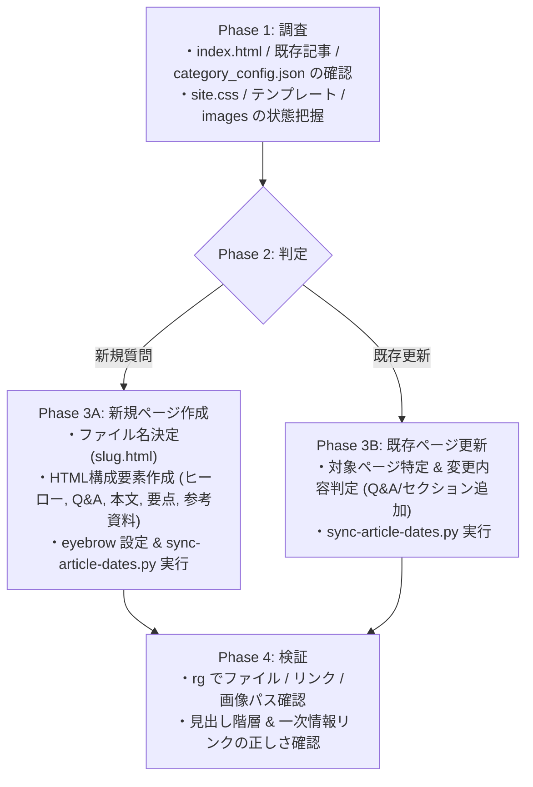
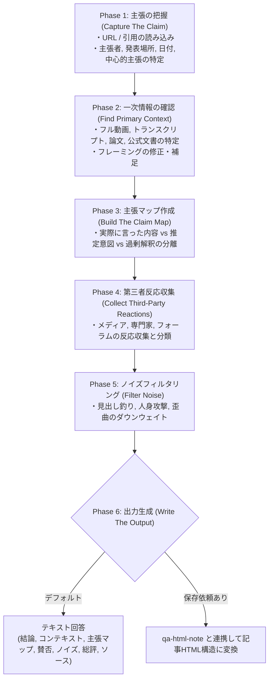
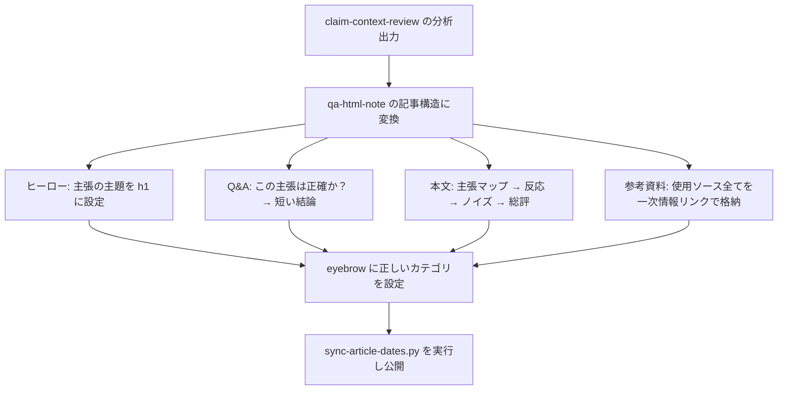

# 詳細設計書（AI Skill 動作仕様）
**AI エージェント Skill 発火条件・制御フロー・品質検証仕様**

| 項目 | 内容 |
| :--- | :--- |
| 文書番号 | KNB-DD-006 |
| ドキュメント名 | 詳細設計書（AI Skill 動作仕様） |
| 版数 | Rev.1.1 |
| 改訂日 | 2026-08-15 |
| 作成日 | 2026-06-14 |
| 作成者 | 開発チーム |

---

本ドキュメントは `.codex/skills/` 配下に定義された AI Skill の発火条件、処理フロー、入出力、制約をプログラム仕様書の粒度で記述する。

## 1. Skill 概要

| #   | Skill ID               | 配置パス                                      | 主な用途                             |
| --- | ---------------------- | --------------------------------------------- | ------------------------------------ |
| 1   | `qa-html-note`         | `.codex/skills/qa-html-note/SKILL.md`         | 技術質問を HTML 記事として記録       |
| 2   | `claim-context-review` | `.codex/skills/claim-context-review/SKILL.md` | 公開主張のコンテキスト検証・反応整理 |

---

## 2. Skill: `qa-html-note`

### 2.1 メタデータ

```yaml
name: qa-html-note
description: >
  Create or update Japanese Q&A-style HTML knowledge notes in this repository.
  Use when the user message starts with "質問" or asks to record a technical
  question as an HTML article.
```

### 2.2 発火条件

| 条件                                   | 判定方法                             |
| -------------------------------------- | ------------------------------------ |
| ユーザーメッセージが「質問」で始まる   | 先頭一致（前後空白トリム後）         |
| 技術質問を HTML 記事として記録する依頼 | 意味的判定                           |
| 既存記事への追加・修正依頼             | 記事ファイル名またはタイトルへの言及 |

### 2.3 処理フロー



> **パイプライン方式の選択**: Phase 3A での記事HTML構成は、`article_builder.py` の `build_article_html()` を経由する。従来の構造化 JSON 方式（`sections` キー）と、自由形式 Markdown パイプライン方式（`markdown_text` キー、→ KNB-DD-002 §16 参照）のいずれかを入力に応じて自動選択する。Skill の実行可能性評価については KNB-DD-007 §1-2 を参照。

### 2.4 入力仕様

| 入力         | 形式                   | 例                                                     |
| ------------ | ---------------------- | ------------------------------------------------------ |
| 技術質問     | 自然言語（日本語）     | 「質問 MCPはなぜサーバーを立ち上げる必要があるのか？」 |
| 対象記事指定 | ファイル名 or タイトル | 「mcp-server.html に追記して」                         |
| 追加情報     | URL、コード、制約      | 「公式ドキュメントのURLは...」                         |

### 2.5 出力仕様

| 出力                 | 形式          | 配置                            |
| -------------------- | ------------- | ------------------------------- |
| 記事 HTML            | UTF-8 LF      | `public/articles/<slug>.html`   |
| 図解 SVG（任意）     | UTF-8 LF      | `public/images/<name>.svg`      |
| index.html 更新      | UTF-8 LF      | `public/index.html`（スクリプト経由） |
| 新規カテゴリ定義（必要時のみ）| JSON          | `config/category_config.json`   |

### 2.6 制約

| ルール           | 詳細                                           |
| ---------------- | ---------------------------------------------- |
| 言語             | 日本語（ユーザーが別言語を明示しない限り）     |
| フォーマット     | 静的 HTML/CSS/SVG のみ。ビルドシステム追加禁止 |
| 参考資料         | 一次情報必須（最低1件）                        |
| 確認不能な事実   | 不確実性を明示し、断言しない                   |
| 個人情報         | 一切記載禁止                                   |
| Git 操作         | ユーザー明示依頼時のみ commit/push             |
| カテゴリ構造     | フォルダ分けしない。index.html の UI のみ      |
| JS 使用          | 禁止                                           |
| ローカルサーバー | 検証後は必ず停止                               |

### 2.7 既存ページ更新の判定基準

| 状況                       | アクション                         |
| -------------------------- | ---------------------------------- |
| 同トピックの記事が存在     | 既存ページに Q&A or セクション追加 |
| 類似だが異なる質問         | 新規ページ作成                     |
| ページのスコープが変わった | index のサマリー更新               |
| スタイル的な不統一のみ     | 変更しない                         |

### 2.8 図解 SVG 作成基準

| 作成する         | 作成しない             |
| ---------------- | ---------------------- |
| 概念フロー       | 表で十分な比較         |
| アーキテクチャ図 | テキストで明確なリスト |
| 状態遷移         | 装飾のみの目的         |
| データフロー     | 既存図で説明可能       |

SVG 仕様:
- モバイル可読（大ラベル、シンプルな矢印、密なテキスト禁止）
- `alt` テキスト必須
- `figcaption` 推奨
- 配置: `public/images/` 直下

---

## 3. Skill: `claim-context-review`

### 3.1 メタデータ

```yaml
name: claim-context-review
description: >
  Use when the user provides a URL, article, interview, speech, podcast
  transcript, social post, or quoted excerpt and asks to summarize, interpret,
  fact-check, contextualize, or collect reactions to a named person's or
  organization's claim.
```

### 3.2 発火条件

| 条件                                | 判定方法                        |
| ----------------------------------- | ------------------------------- |
| URL付きで要約・検証・反応収集を依頼 | URL + 意図動詞の組み合わせ      |
| 記事・発言の引用を提示して解説依頼  | 引用テキスト + 質問             |
| 特定人物/組織の主張について分析依頼 | 人名/組織名 + 主張 + 検証系動詞 |

### 3.3 処理フロー



### 3.4 入力仕様

| 入力             | 形式             | 例                                             |
| ---------------- | ---------------- | ---------------------------------------------- |
| URL              | HTTPS リンク     | `https://example.com/article`                  |
| 引用テキスト     | テキストブロック | 「〇〇氏は△△と述べた」                         |
| 検証指示         | 自然言語         | 「この記事の主張を検証して」「反応をまとめて」 |
| 保存指示（任意） | 自然言語         | 「記事にして保存して」                         |

### 3.5 出力仕様

#### テキスト回答（デフォルト）

```
1. 短い結論
2. コンテキスト（誰・どこ・いつ）
3. 主張マップ
   - 実際に言った
   - 意図した意味
   - 言っていない/過剰解釈
   - 実務的意味
   - 不確実性
4. 賛成反応（2-5テーマ + ソース例）
5. 批判反応（2-5テーマ + ソース例）
6. ノイズ確認（よくある歪曲パターン）
7. 総評（最も公平な解釈）
8. ソース一覧（一次情報優先）
```

#### HTML記事保存（依頼時）

`qa-html-note` の記事構造に従いつつ、上記分析セクションを本文として構成:
- `section.qa`: 主張の1文要約と結論
- 本文: 主張マップ → 賛否 → ノイズ → 総評
- 参考資料: 使用ソースすべて

### 3.6 制約

| ルール       | 詳細                                                      |
| ------------ | --------------------------------------------------------- |
| 中立性       | 主張を良く/悪く見せない。コンテキスト回復が目的           |
| 4層分離      | 発言内容/著者解釈/増幅者の主張/独立検証可能な事実を分ける |
| ラベリング   | 解釈・反応・修辞的利用をファクトとして提示しない          |
| 日付         | 速報的議論には必ず日付を付記                              |
| 一次情報優先 | 合理的に存在する場合は必ず確認                            |
| ノイズの扱い | 影響力のあるノイズは隠さず「ノイズパターン」として記述    |
| 不確実性     | ギャップを推測で埋めない。制限を明示                      |
| 個人情報     | リポジトリファイルに含めない                              |
| 言語         | ユーザーの言語（通常日本語）                              |

### 3.7 品質チェックリスト（出力前に確認）

- [ ] 一次情報のコンテキストを確認したか（存在する場合）
- [ ] 話者の主張と記事著者のフレーミングを区別したか
- [ ] 賛否両方を含め、すべてが同等に信頼できるふりをしていないか
- [ ] 引用切り取りのリスクを明示したか
- [ ] 個人情報・非公開情報を含めていないか
- [ ] 使用ソースを引用したか（一次情報優先）
- [ ] ギャップを推測で埋めず不確実性を述べたか

---

## 4. Skill 間の連携

### 連携パターン: `claim-context-review` → `qa-html-note`

**トリガー**: ユーザーが主張検証の結果を「記事にして保存して」と依頼した場合



### 連携時のクラスタ割り当て

| 主張の分野             | 割り当てクラスタ     |
| ---------------------- | -------------------- |
| AI関連の発言           | `ai-articles-papers` |
| 開発ツール・言語の発言 | 対応するクラスタ     |
| 判断できない場合       | ユーザーに確認       |

---

## 5. Skill の非発火条件

以下の場合は Skill を使わず通常の回答を行う:

| 状況                                   | 理由                                    |
| -------------------------------------- | --------------------------------------- |
| 単純なコード質問（記事化不要）         | 保存の意図がない                        |
| 既知の事実確認（検証不要）             | `claim-context-review` の対象ではない   |
| リポジトリ構造・設定の質問             | Skill の範囲外                          |
| ドキュメント作成（技術質問形式でない） | `qa-html-note` のフォーマットに合わない |

---

## 6. エラーハンドリング

| 状況                                       | Skill の挙動                                     |
| ------------------------------------------ | ------------------------------------------------ |
| URL にアクセスできない                     | タイトル/スラグで代替検索。取得元を明示          |
| 一次情報が見つからない                     | 制限を明記し、記事のフレーミングのみで分析       |
| 既存記事の特定に失敗                       | ユーザーに確認（「どの記事を指していますか？」） |
| 参考となる一次情報がゼロ                   | 記事作成を拒否し理由を説明                       |
| 登録すべきクラスタが `category_config.json` に未定義 | ユーザーに選択肢を提示、または JSON に追記       |
| sync スクリプトが未実装                    | 手動で index を更新するか、スクリプト実装を提案  |

---

## 7. 改訂履歴 (Change Log)

| 版数 | 改訂日 | 変更者 | 変更内容・変更理由 (Why) |
| :--- | :--- | :--- | :--- |
| Rev.1.0 | 2026-08-13 | 開発チーム | TEMPLATEに準拠したドキュメント構造化およびフォーマット標準化 |
| Rev.1.1 | 2026-08-15 | 開発チーム | ドキュメント間整合性レビュー反映：§2.3にMarkdownパイプライン連携の注記追加、KNB-DD-007への相互参照を追加 |
