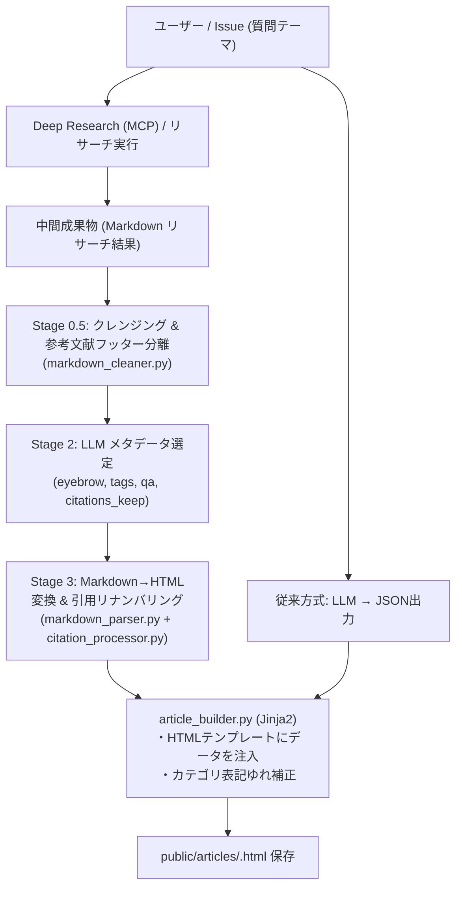
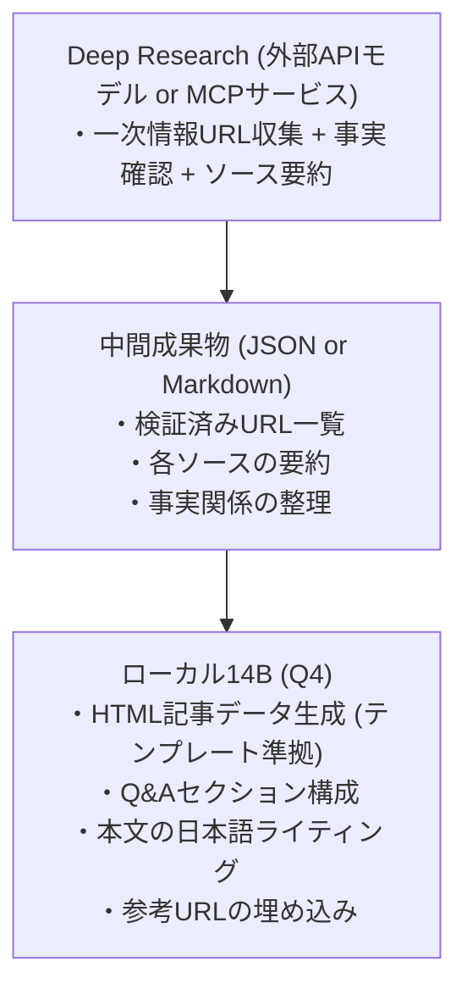

# 詳細設計書（ローカルLLM運用・Deep Research連携仕様）
**ローカルLLMアーキテクチャ・14Bモデル評価・Deep Researchハイブリッド連携仕様**

| 項目 | 内容 |
| :--- | :--- |
| 文書番号 | KNB-DD-007 |
| ドキュメント名 | 詳細設計書（ローカルLLM運用・Deep Research連携仕様） |
| 版数 | Rev.1.1 |
| 改訂日 | 2026-08-15 |
| 作成日 | 2026-06-14 |
| 作成者 | 開発チーム |

---

本ドキュメントは、ローカルLLM（14Bパラメータクラス/Q4量子化）でのAI Skill運用可能性、ならびに Deep Research MCP との2段階ハイブリッドパイプライン構成・実行アーキテクチャを定義する。

---

## 1. ローカルLLM（14B Q4）における Skill 評価

### 1.1 評価結論
**`qa-html-note` は条件付きで可能。`claim-context-review` は単体での実用は厳しく、2段階ハイブリッド化が必須。**

### 1.2 Skill 別の詳細評価

#### `qa-html-note`（技術Q&A記事作成）

| 要求される能力 | 14B Q4 で対応可能か | 理由 |
|--------------|-------------------|------|
| 日本語の技術解説生成 | △ | 14Bでも日本語品質はモデルに強く依存。Qwen2.5-14B等なら許容範囲 |
| HTML テンプレート遵守 | ○ | 構造が固定で例示が豊富なら追従できる |
| 見出し階層の維持 | ○ | ルールベースに近い |
| 一次情報の参考リンク生成 | × | ハルシネーションリスクが高い。URLを正確に生成できない |
| ファイル操作（作成・編集） | ー | LLM能力ではなくツール連携の問題 |
| sync スクリプト実行判断 | △ | 指示テンプレートに従えば可能 |

**現実的な運用案**: テンプレートの穴埋め＋本文生成に限定し、参考URL は人間または外部リサーチで補完する。

#### `claim-context-review`（主張のコンテキスト検証）

| 要求される能力 | 14B Q4 で対応可能か | 理由 |
|--------------|-------------------|------|
| URL の内容理解 | △ | テキスト入力できれば処理可能。だがコンテキスト長の制約がきつい |
| Web検索→複数ソース統合 | × | ツール呼び出し + 長文マルチソース統合は14Bの弱点 |
| 4層分離（発言/解釈/増幅/事実） | × | 高度な推論。70B+でも難しい場面がある |
| ノイズフィルタリング | × | メタ認知的な判断が必要 |
| 賛否の公平な整理 | △ | バイアスが入りやすい |
| 6セクション構造化出力 | △ | 長い構造化出力は途中で破綻しやすい |

---

## 2. 14B Q4 の一般的な限界とモデル選定

### 2.1 制約事項

| 制約 | 影響 |
|------|------|
| コンテキスト長 | 多くの14Bモデルは実効4K〜8Kトークンで品質低下。記事生成に必要な入力+出力が収まらない場合がある |
| 日本語性能 | 英語比で明確に劣化する。Qwen2.5系やGemma系は比較的マシだが、専門用語の正確性は落ちる |
| Q4 量子化の影響 | FP16比で推論品質が2-5%低下。長文構造化タスクほど累積的に効く |
| ツール呼び出し | Function calling を安定して行えるモデルが限られる |
| ハルシネーション | パラメータ数が少ないほど事実の正確性が低い。参考URLの捏造が頻発する |

### 2.2 推奨モデル候補

| モデル | 日本語 | 構造化出力 | コンテキスト長 |
|--------|--------|-----------|---------------|
| Qwen2.5-14B-Instruct (Q4_K_M) | ◎ | ○ | 128K（実効は短い） |
| Gemma 3 14B (Q4) | ○ | ○ | 128K |
| Phi-4 14B (Q4) | △ | ○ | 16K |

---

## 3. 実装アーキテクチャ (Jinja2 + JSON/Markdown ハイブリッド構造化出力)

「Jinja2テンプレートによるHTML出力保証 ＋ LLMには構造化JSONのみを出力させる」従来方式に加え、自由形式 Markdown からの Stage 0.5〜5 パイプライン変換方式（→ 詳細は KNB-DD-002 §16 を参照）をサポートしている。

### コンポーネント役割

1. **`src/scripts/generate-article.py` / `sync-github-issues.py`**
   - ローカルLLM（Ollama上の `gemma4-12b` や `qwen2.5` 等）に対し、JSONデータまたはメタデータ選定結果を要求。
   - LLMから得られた生応答を `logs/llm_output.log` へ自動保存。
2. **`src/app/article_builder.py`**
   - **従来方式**: JSONデータを読み取り、Jinja2テンプレート (`article_template.html`) に流し込み静的HTMLをビルド。
   - **Markdown パイプライン方式**: `parse_reference_footer`（Stage 0.5）→ `FlexibleMarkdownParser`（Stage 3a）→ `apply_citations`（Stage 3b）を経由して `site.css` 適合 HTML を生成。
   - **カテゴリ表記ゆれ補正**: 不完全なカテゴリ名を `category_config.json` の正式名称へマッピング補正。

---

## 4. Deep Research 連携（2段階ハイブリッドパイプライン）

### 4.1 パイプライン構成

### 4.2 役割分担マッピング

| 14B Q4 の弱点 | Deep Research で解決 |
|--------------|---------------------|
| 参考URLのハルシネーション | 検証済みURLを事前に確定 |
| 事実の正確性 | ソース付き要約を入力に含める |
| Web検索能力の欠如 | 検索・取得はDeep Research側が担当 |
| マルチソース統合 | 要約済みの構造化データとして渡す |

| 14B Q4 が担当 | 理由 |
|--------------|------|
| HTML構造の生成 | テンプレート追従は得意 |
| 日本語の文章化 | 入力が正確なら出力品質も安定 |
| Q&A形式への変換 | パターンマッチ的タスク |
| 要点の要約 | 入力が整理済みなら圧縮は可能 |

---

## 5. Deep Research MCP 運用上のルール

Deep Research MCP を使用して調査を行う際、検索・探索の意図した結果取得およびハング防止のためにクエリ指定の工夫を行う。

### クエリ設計ルール
- **NG例**: `テスト`（曖昧すぎて検索ループロジックがハングする）
- **OK例**: `MCP（Model Context Protocol）の概要と、主要なトランスポート（stdio, sse）の違いについて調査してください`

---

## 6. 改訂履歴 (Change Log)

| 版数 | 改訂日 | 変更者 | 変更内容・変更理由 (Why) |
| :--- | :--- | :--- | :--- |
| Rev.1.0 | 2026-08-13 | 開発チーム | TEMPLATEに準拠したドキュメント構造化およびフォーマット標準化 |
| Rev.1.1 | 2026-08-15 | 開発チーム | ドキュメント間整合性レビュー反映：§3のフロー図をMarkdownパイプライン対応に更新、article_builder.pyの最新モジュール連携説明を追加 |
