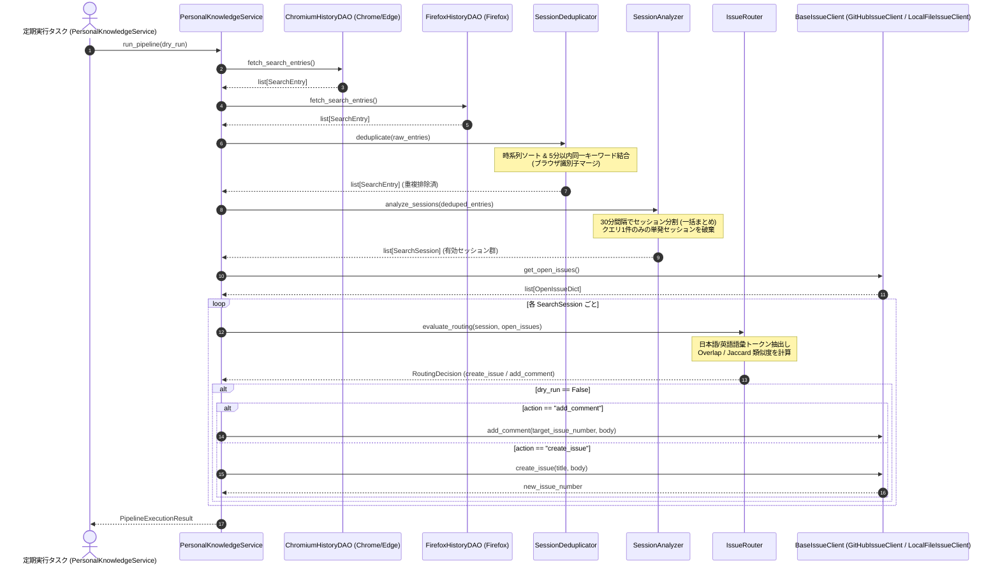

# 詳細設計書（ブラウザ検索履歴収集・セッション解析・Issueルーティング仕様）
**検索履歴収集(DAO)・重複排除/セッション解析(Domain)・Issueルーティング(Integration)仕様**

| 項目 | 内容 |
| :--- | :--- |
| 文書番号 | KNB-DD-008 |
| ドキュメント名 | 詳細設計書（ブラウザ検索履歴収集・セッション解析・Issueルーティング仕様） |
| 版数 | Rev.1.1 (Issueクライアント分離・ローカルストレージ仕様の反映) |
| 改訂日 | 2026-08-25 |
| 作成日 | 2026-08-23 |
| 作成者 | 開発チーム |

---

## 1. 目的とスコープ

本ドキュメントは、パーソナル・ナレッジ自動生成システムにおいて以下の具象モジュール仕様を規定する。

1. **データアクセス層 (DAO)**: Chrome, Edge, Firefox からの安全なSQLite読み込みと検索クエリ抽出
2. **ビジネスロジック層 (Domain)**: 時系列5分以内重複排除、30分セッション分割（一括まとめ・クラスタリング）、単発検索（1件のみ）の破棄
3. **連携層 (Integration)**: Jaccard / Szymkiewicz-Simpson Overlap 係数に基づく Open Issue へのルーティング、および `BaseIssueClient`（GitHub REST API / ローカルJSONストレージ）抽象化

---

## 2. 処理フローとシーケンス



---

## 3. レイヤー別具象仕様

### 3.1 データモデル (DTO)

```python
from dataclasses import dataclass, field
from datetime import datetime

@dataclass
class SearchEntry:
    """ブラウザから抽出された単一検索クエリDTO"""
    timestamp: datetime
    keyword: str
    source_browser: str

@dataclass
class SearchSession:
    """30分以内の連続検索で構成されるセッションDTO"""
    start_time: datetime
    end_time: datetime
    queries: list[str]
    source_browsers: list[str] = field(default_factory=list)

@dataclass
class RoutingDecision:
    """ルーティング判定結果DTO"""
    action: str  # 'create_issue' または 'add_comment'
    target_issue_number: int | None
    similarity_score: float
    title: str
    body: str
```

---

### 3.2 データアクセス層 (DAO) 仕様

#### ① パス解決とハードコード定義
外部からのファイルパス指定は排除し、各ブラウザの標準プロファイルパスを定義する。

```python
# Chromium 系 (Windows)
CHROME_HISTORY_PATH = Path(os.environ.get("LOCALAPPDATA", "")) / "Google/Chrome/User Data/Default/History"
EDGE_HISTORY_PATH = Path(os.environ.get("LOCALAPPDATA", "")) / "Microsoft/Edge/User Data/Default/History"

# Firefox (Windows: プロファイル名が可変のため *.default-release 配下の places.sqlite を探索)
FIREFOX_PROFILES_DIR = Path(os.environ.get("APPDATA", "")) / "Mozilla/Firefox/Profiles"
```

#### ② 安全コピーとサイレントエラー
* `shutil.copy2` を使用して `tempfile.TemporaryDirectory` 配下に複製。
* コピー時やクエリ実行時の `IOError`, `sqlite3.Error` 等の例外は捕捉し、ログ記録の上で空リスト `[]` を返却する（サイレント障害復旧）。

#### ③ URLパース仕様
* `https://www.google.com/search?q=...` 等から `q` パラメータを抽出。
* デコード処理（`urllib.parse.unquote_plus`）を行い、前後の空白を除去。

---

### 3.3 ビジネスロジック層 (Domain) 仕様

#### ① 重複排除モジュール (`Deduplicator`)
* **入力**: `list[SearchEntry]`（複数ブラウザの合算リスト）
* **手順**:
  1. `timestamp` 昇順でソート。
  2. 直前のエントリと比較し、以下を判定：
     - キーワード正規化（大文字小文字・前後の空白を無視）が一致
     - かつ `(current.timestamp - prev.timestamp).total_seconds() <= 300` (5分以内)
  3. 一致した場合、直前のエントリにマージ（`source_browser` が異なればカンマ区切り等で結合、タイムスタンプは最新または開始時を保持）。
* **出力**: 重複排除された `list[SearchEntry]`

#### ② セッション解析モジュール (`Analyzer`) —— 検索の一括まとめ・クラスタリング
* **入力**: 重複排除済み `list[SearchEntry]`
* **手順**:
  1. 時系列順に走査し、直前のクエリとの時間間隔が **30分（1,800秒）以内** であれば同一セッションに追加（クラスタリング）。
  2. 30分を超えた場合、現在のセッションをクローズし新規セッションを開始。
  3. **ノイズ除去**: クエリ数が **1件のみ** の単発検索はノイズとみなし破棄（`len(session.queries) >= 2` のみ残す）。
* **出力**: `list[SearchSession]`

---

### 3.4 連携層 (Integration) 仕様

#### ① Issue クライアント抽象化 (`BaseIssueClient`)
異なるストレージバックエンド（GitHub API / ローカルJSON）を統一的に操作するための抽象インターフェース。

```python
class BaseIssueClient(ABC):
    @property
    @abstractmethod
    def is_configured(self) -> bool: ...
    @abstractmethod
    def get_open_issues(self) -> list[dict[str, Any]]: ...
    @abstractmethod
    def create_issue(self, title: str, body: str) -> int | None: ...
    @abstractmethod
    def add_comment(self, issue_number: int, comment_body: str) -> bool: ...
    @abstractmethod
    def close_issue(self, issue_number: int) -> bool: ...
```

##### 実装1: `GitHubIssueClient`
- GitHub REST API (`https://api.github.com/repos/{owner}/{repo}/issues`) を通じて Issue の取得・起票・コメント追記を行う。
- 認証: `Authorization: Bearer <GITHUB_TOKEN>`
- 環境変数 `GITHUB_REPOSITORY` および `GITHUB_TOKEN` を参照。

##### 実装2: `LocalFileIssueClient`
- GitHub に依存せず、ローカル JSON ファイル (`data/personal_knowledge_issues.json`) またはメモリ上で Issue データを保持・更新する。
- 自動インクリメント ID 発行、永続化・再読み込み機能を搭載。

#### ② Issue ルーティング判定 (`IssueRouter`)
* **単語トークナイズ**:
  - 英数字単語、カタカナ単語、漢字連続語、日本語フレーズを正規化抽出し、ノイズワード（ストップワード）を除去。
* **類似度計算アルゴリズム**: Szymkiewicz-Simpson Overlap 係数 / Jaccard 係数
  $$ \text{Overlap}(A, B) = \frac{|A \cap B|}{\min(|A|, |B|)}, \quad \text{Coverage}(A, B) = \frac{|A \cap B|}{|A|} $$
  $$ \text{Score} = \max(\text{Coverage}, \text{Overlap}, \text{Jaccard}) $$
* **ルーティング分岐**:
  - `max_similarity >= similarity_threshold` (標準閾値: 0.3): 最大類似度の Issue にコメントとしてセッション内容を追記。
  - `max_similarity < 0.3`: 新規 Issue を作成。
    - タイトル: `[自動抽出] <代表クエリ> 関連の調査`
    - 本文: 開始日時、終了日時、検出ブラウザ、検索クエリ一覧。

---

## 4. エラーハンドリングと例外設計

| 発生レイヤー | 想定異常事象 | 処置 |
| :--- | :--- | :--- |
| **DAO層** | ブラウザ起動中によるDBロック | 一時コピーにより回避。コピー自体の失敗時はサイレントにスキップ |
| **DAO層** | Firefox プロファイルディレクトリ不存在 | インストールなしとみなし安全にスキップ |
| **Domain層** | タイムスタンプ欠損 / 不正文字列 | 当該レコードのみスキップして処理継続 |
| **Integration層** | GitHub API トークン未設定 / 通信エラー | ログ記録し `LocalFileIssueClient` へのフォールバックまたは次回実行へ延期 |

---

## 5. 単体テスト要件

1. **DAO層テスト (`test_personal_knowledge_dao.py`)**:
   - SQLiteモックファイルを作成し、WebKit時間/PRTimeの変換、URLからのクエリ抽出を検証。
   - ファイル不在・コピー失敗時のサイレント動作（例外送出せず空リスト返却）を検証。
2. **重複排除・セッション解析テスト (`test_personal_knowledge_domain.py`)**:
   - 5分以内の同一キーワード結合、30分以内のグループ化、1件のみ単発検索の破棄を検証。
3. **Issueクライアントテスト (`test_local_file_client.py`)**:
   - `LocalFileIssueClient` のメモリ動作および JSON ファイルへのデータ読み書き・永続化を検証。
4. **ルーティングテスト (`test_personal_knowledge_router.py` / `test_personal_knowledge_service.py`)**:
   - 語彙トークナイズおよび Overlap / Jaccard 類似度計算の検証。
   - `PersonalKnowledgeService` と `GitHubIssueClient` / `LocalFileIssueClient` のパイプライン結合テスト。

---

## 6. 改訂履歴 (Change Log)

| 版数 | 改訂日 | 変更者 | 変更内容・変更理由 (Why) |
| :--- | :--- | :--- | :--- |
| Rev.1.0 | 2026-08-23 | 開発チーム | 新規作成（ブラウザ履歴収集・セッション解析・Issueルーティング詳細設計初版制定） |
| Rev.1.1 | 2026-08-25 | 開発チーム | `BaseIssueClient` 抽象化、`LocalFileIssueClient` 詳細、Overlap/Jaccardハイブリッド類似度仕様の反映 |
