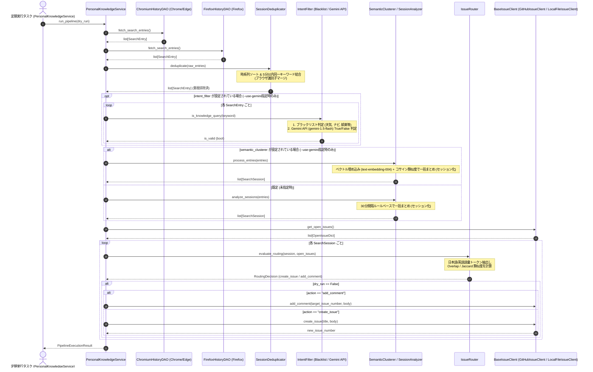

# 詳細設計書（ブラウザ検索履歴収集・セッション解析・Issueルーティング仕様）
**検索履歴収集(DAO)・重複排除/セッション解析(Domain)・Issueルーティング(Integration)仕様**

| 項目           | 内容                                                                      |
| :------------- | :------------------------------------------------------------------------ |
| 文書番号       | KNB-DD-008                                                                |
| ドキュメント名 | 詳細設計書（ブラウザ検索履歴収集・セッション解析・Issueルーティング仕様） |
| 版数           | Rev.1.5 (Mypy型エラー修復・Ruffフォーマット・テスト整合反映)              |
| 改訂日         | 2026-08-27                                                                |
| 作成日         | 2026-08-23                                                                |
| 作成者         | 開発チーム                                                                |

---

## 1. 目的とスコープ

本書は、本システムにおける関数呼び出し順序・制御フロー・状態遷移ルーティング・DTOスキーマ・エラー対処契約の正本 (SSOT) とする。ストレージ構造や永続化スキーマ（DAO/State正本）については「データ構造仕様書 (KNB-DS-002)」を参照する。

本ドキュメントは、パーソナル・ナレッジ自動生成システムにおいて以下の具象モジュール仕様を規定する。

1. **データアクセス層 (DAO)**: Chrome, Edge, Firefox からの安全なSQLite読み込みと検索クエリ抽出
2. **ビジネスロジック層 (Domain)**:
   - 時系列5分以内重複排除 (`SessionDeduplicator`)
   - クエリ意図判定フィルタ (`IntentFilter`: ブラックリスト＋Gemini API `gemini-1.5-flash` LLM判定)
   - 30分セッション分割 (`SessionAnalyzer`) および ベクトル埋め込みクラスタリング (`SemanticClusterer`: `text-embedding-004`＋コサイン類似度)
3. **連携層 (Integration)**: Jaccard / Szymkiewicz-Simpson Overlap 係数に基づく Open Issue へのルーティング、および `BaseIssueClient`（GitHub REST API / ローカルJSONストレージ）抽象化

---

## 2. 処理フローとシーケンス

---

## 3. レイヤー別具象仕様

### 3.1 データモデル (DTO)

本モジュール群で受け渡しされるDTOのフィールド仕様を以下に示す。本書を各DTOのSSOT（正本）とする。

#### ① `SearchEntry`（ブラウザから抽出された単一検索クエリ）
| フィールド名     | データ型   | 必須性 | デフォルト値 | 説明                                                                               |
| :--------------- | :--------- | :----: | :----------- | :--------------------------------------------------------------------------------- |
| `timestamp`      | `datetime` |  必須  | なし         | 検索が実行されたUTC日時                                                            |
| `keyword`        | `str`      |  必須  | なし         | 検索キーワード文字列                                                               |
| `source_browser` | `str`      |  必須  | なし         | 取得元ブラウザ識別子 (`chrome`, `edge`, `firefox`)。重複統合時はカンマ区切りで結合 |

#### ② `SearchSession`（30分以内の連続検索または意味的クラスタで構成されるセッション）
| フィールド名      | データ型    | 必須性 | デフォルト値 | 説明                                              |
| :---------------- | :---------- | :----: | :----------- | :------------------------------------------------ |
| `start_time`      | `datetime`  |  必須  | なし         | セッション内の最古クエリ検索日時                  |
| `end_time`        | `datetime`  |  必須  | なし         | セッション内の最新クエリ検索日時                  |
| `queries`         | `list[str]` |  必須  | なし         | セッションに含まれる一連のクエリリスト（2件以上） |
| `source_browsers` | `list[str]` |  任意  | 空リスト     | セッションに関与したブラウザ識別子のリスト        |

#### ③ `RoutingDecision`（ルーティング判定結果）
| フィールド名          | データ型      | 必須性 | デフォルト値 | 説明                                                               |
| :-------------------- | :------------ | :----: | :----------- | :----------------------------------------------------------------- |
| `action`              | `str`         |  必須  | なし         | `'create_issue'`（新規起票）または `'add_comment'`（コメント追記） |
| `target_issue_number` | `int \| None` |  必須  | `None`       | コメント追記先Issue番号（`action == 'add_comment'` の場合）        |
| `similarity_score`    | `float`       |  必須  | なし         | 最大類似度スコア (0.0〜1.0)                                        |
| `title`               | `str`         |  必須  | なし         | 新規起票時のタイトル（`add_comment` 時は空文字）                   |
| `body`                | `str`         |  必須  | なし         | 起票本文または追記コメント本文                                     |

---

### 3.2 データアクセス層 (DAO) 仕様

#### ① パス解決とハードコード定義
外部からのファイルパス指定は排除し、各ブラウザの標準プロファイルパスをコード内に定義する。

| ブラウザ | 基準環境変数   | 相対パス                                                   | 補足                                                      |
| :------- | :------------- | :--------------------------------------------------------- | :-------------------------------------------------------- |
| Chrome   | `LOCALAPPDATA` | `Google/Chrome/User Data/Default/History`                  | 固定パス                                                  |
| Edge     | `LOCALAPPDATA` | `Microsoft/Edge/User Data/Default/History`                 | 固定パス                                                  |
| Firefox  | `APPDATA`      | `Mozilla/Firefox/Profiles/*.default-release/places.sqlite` | プロファイル名が可変のため `*.default-release` 配下を探索 |

#### ② 安全コピーとサイレントエラー
* `shutil.copy2` を使用して `tempfile.TemporaryDirectory` 配下に複製。
* コピー時やクエリ実行時の `IOError`, `sqlite3.Error` 等の例外は捕捉し、ログ記録の上で空リスト `[]` を返却する（サイレント障害復旧）。

#### ③ URLパース仕様
* `https://www.google.com/search?q=...` 等から `q` パラメータを抽出。
* デコード処理（`urllib.parse.unquote_plus`）を行い、前後の空白を除去。

---

### 3.3 ビジネスロジック層 (Domain) 仕様

#### ① 重複排除モジュール (`Deduplicator`)
* **入力**: `list[SearchEntry]`（複数ブラウザの合算リスト）
* **手順**:
  1. `timestamp` 昇順でソート。
  2. 直前のエントリと比較し、以下を判定：
     - キーワード正規化（大文字小文字・前後の空白を無視）が一致
     - かつ `(current.timestamp - prev.timestamp).total_seconds() <= 300` (5分以内)
  3. 一致した場合、直前のエントリにマージ（`source_browser` が異なればカンマ区切り等で結合、タイムスタンプは最新または開始時を保持）。
* **出力**: 重複排除された `list[SearchEntry]`

#### ② 意図判定フィルタリング (`IntentFilter.is_knowledge_query`)
* **目的**: 天気予報、乗換案内、ログイン、動画鑑賞等の日常消費・ナビゲーション検索を除外し、知識習得・技術解決目的のクエリのみを抽出する。
* **有効化方式**: `PersonalKnowledgeService` のオプション引数 `intent_filter` にインスタンスを渡した場合のみ有効化される（オプトイン）。CLI では `--use-gemini` フラグ指定時に有効化される。未指定時はフィルタリングを行わず、重複排除後の全エントリがそのままセッション分割の入力となる。
* **手順**:
  1. **ブラックリスト判定 (`_is_blacklisted`)**: `config/personal_knowledge_config.json` の `filtering.blacklisted_keywords` （既定値: `["天気", "乗り換え", "ログイン", "amazon", "youtube", "マップ"]`）に、小文字化した上で部分一致する場合は即座に `False` を返却（LLM呼び出しは行わない）。
  2. **LLM意図判定 (`_judge_with_llm`)**: `google-genai` SDK (`google.genai.Client`) を用いて Gemini API (既定モデル: `gemini-1.5-flash`) を呼び出す。
     - `client.models.generate_content(model=chat_model, contents=keyword, config=types.GenerateContentConfig(system_instruction=system_prompt, temperature=0.0))` の形式で呼び出す。
     - レスポンステキストを小文字化・前後空白除去した上で `"true"` から始まる場合のみ `True` と判定する。
     - システムプロンプトは `config/personal_knowledge_config.json` の `filtering.llm_system_prompt` から読み込む（既定値は §3.2 に同じ）。
  3. **エラー時フォールバック**: API呼び出しまたはレスポンス解析で例外が発生した場合は、警告ログを出力し安全なデフォルトとして `False` を返却する（サイレントフォールト）。

#### ③ セッション解析・クラスタリング (`SessionAnalyzer` / `SemanticClusterer`)
* **ルールベース方式 (`SessionAnalyzer`)**: 既定で使用される方式。
  - 時系列順に走査し、直前のクエリとの時間間隔が **30分（1,800秒）以内** であれば同一セッションに追加。クエリ数が1件のみの単発検索はノイズとみなし破棄。
* **ベクトル埋め込み方式 (`SemanticClusterer.process_entries`)**: `PersonalKnowledgeService` のオプション引数 `semantic_clusterer` にインスタンスを渡した場合、`SessionAnalyzer` の代わりに使用される（オプトイン。CLI `--use-gemini` 指定時）。
  - `google-genai` SDK の `client.models.embed_content(model=embed_model, contents=keyword)` （既定モデル: `models/text-embedding-004`）で各クエリを個別にベクトル化する。API失敗時はゼロベクトル（空リスト）にフォールバックする。
  - **クラスタリングアルゴリズム（貪欲最近傍法）**: 時系列順に走査し、各エントリのベクトルと、既存の全クラスタの代表ベクトル（各クラスタの先頭エントリのベクトル）とのコサイン類似度を総当たりで計算する。最大類似度が閾値 (`similarity_threshold`, 既定 `0.70`) 以上であれば最も類似度が高いクラスタに追加し、閾値未満（または既存クラスタが無い）場合は新規クラスタを作成する。
  - コサイン類似度は `(A・B) / (|A| × |B|)` で計算し、いずれかがゼロベクトルの場合は `0.0` を返す（ゼロ除算回避）。
  - 各クラスタから `SearchSession`（開始/終了日時、クエリ一覧、関与ブラウザ一覧）を生成する。単発（1件のみ）クラスタも破棄せずセッション化する点が `SessionAnalyzer` と異なる。

---

### 3.4 連携層 (Integration) 仕様

#### ① Issue クライアント抽象化 (`BaseIssueClient`)
異なるストレージバックエンド（GitHub API / ローカルJSON）を統一的に操作するための抽象インターフェース。実装クラスは以下の抽象メンバー全てを実装する契約とする。

| メンバー名        | 種別           | 引数                                     | 戻り値                 | 説明                                                   |
| :---------------- | :------------- | :--------------------------------------- | :--------------------- | :----------------------------------------------------- |
| `is_configured`   | 抽象プロパティ | なし                                     | `bool`                 | クライアントが利用可能な状態か（認証情報設定済みか等） |
| `get_open_issues` | 抽象メソッド   | なし                                     | `list[dict[str, Any]]` | Open状態のIssue一覧を取得                              |
| `create_issue`    | 抽象メソッド   | `title: str`, `body: str`                | `int \| None`          | 新規Issueを起票し、起票番号を返却（失敗時 `None`）     |
| `add_comment`     | 抽象メソッド   | `issue_number: int`, `comment_body: str` | `bool`                 | 既存Issueにコメントを追記、成功時 `True`               |
| `close_issue`     | 抽象メソッド   | `issue_number: int`                      | `bool`                 | Issueをクローズ状態に変更、成功時 `True`               |

##### 実装1: `GitHubIssueClient`
- GitHub REST API (`https://api.github.com/repos/{owner}/{repo}/issues`) を通じて Issue の取得・起票・コメント追記を行う。
- 認証: `Authorization: Bearer <GITHUB_TOKEN>`
- 環境変数 `GITHUB_REPOSITORY` および `GITHUB_TOKEN` を参照。

##### 実装2: `LocalFileIssueClient`
- GitHub に依存せず、ローカル JSON ファイル (`data/personal_knowledge_issues.json`) またはメモリ上で Issue データを保持・更新する。
- 自動インクリメント ID 発行、永続化・再読み込み機能を搭載。

#### ② Issue ルーティング判定 (`IssueRouter`)
* **単語トークナイズ**:
  - 英数字単語、カタカナ単語、漢字連続語、日本語フレーズを正規化抽出し、ノイズワード（ストップワード）を除去。
* **類似度計算アルゴリズム**: Szymkiewicz-Simpson Overlap 係数 / Jaccard 係数
  $$ \text{Overlap}(A, B) = \frac{|A \cap B|}{\min(|A|, |B|)}, \quad \text{Coverage}(A, B) = \frac{|A \cap B|}{|A|} $$
  $$ \text{Score} = \max(\text{Coverage}, \text{Overlap}, \text{Jaccard}) $$
* **ルーティング分岐**:
  - `max_similarity >= similarity_threshold` (標準閾値: 0.3): 最大類似度の Issue にコメントとしてセッション内容を追記。
  - `max_similarity < 0.3`: 新規 Issue を作成。
    - タイトル: `[自動抽出] <代表クエリ> 関連の調査`
    - 本文: 開始日時、終了日時、検出ブラウザ、検索クエリ一覧。

---

## 4. エラーハンドリングと例外設計

| 発生レイヤー      | 想定異常事象                           | 処置                                                                                                                                                                                |
| :---------------- | :------------------------------------- | :---------------------------------------------------------------------------------------------------------------------------------------------------------------------------------- |
| **DAO層**         | ブラウザ起動中によるDBロック           | 一時コピーにより回避。コピー自体の失敗時はサイレントにスキップ                                                                                                                      |
| **Domain層**      | Gemini API 意図判定/埋め込みエラー     | `IntentFilter._judge_with_llm` / `SemanticClusterer._embed_text` 内で例外を捕捉し警告ログを出力。安全なデフォルト（意図判定は `False`、埋め込みは空リスト＝ゼロベクトル相当）を返却 |
| **Integration層** | GitHub API トークン未設定 / 通信エラー | ログ記録し `LocalFileIssueClient` へのフォールバックまたは次回実行へ延期                                                                                                            |

---

## 5. 単体テスト要件

1. **DAO層テスト (`test_personal_knowledge_dao.py`)**:
   - SQLiteモックファイルを作成し、WebKit時間/PRTimeの変換、URLからのクエリ抽出を検証。
2. **重複排除・セッション解析テスト (`test_personal_knowledge_domain.py`)**:
   - 5分以内の同一キーワード結合、30分間隔ルールベースセッション分割を検証。
3. **意図判定フィルタテスト (`test_intent_filter.py`)**:
   - ブラックリスト一致時にLLM呼び出しを行わないこと、Gemini APIモックによる `True`/`False` 判定、API例外時に `False` へフォールバックすることを検証。
4. **意味的クラスタリングテスト (`test_semantic_clusterer.py`)**:
   - コサイン類似度関数（同一/直交/ゼロベクトル）、Embeddingモックによるセッション統合、API例外時に空リストへフォールバックすることを検証。
5. **Issueクライアントテスト (`test_local_file_client.py`)**:
   - `LocalFileIssueClient` のメモリ動作および JSON ファイルへのデータ読み書き・永続化を検証。
6. **ルーティング・オーケストレーションテスト (`test_personal_knowledge_router.py` / `test_personal_knowledge_service.py` / `test_service_intent_and_clustering.py`)**:
   - 語彙トークナイズおよび Overlap / Jaccard 類似度計算の検証。
   - `intent_filter` / `semantic_clusterer` 未指定時に既定のルールベース処理のみで動作すること、指定時にオプトイン機能が正しく呼び出されることを検証。
7. **設定ファイル読み込みテスト (`test_config_loader.py`)**:
   - 設定ファイル欠落時・不正JSON時にデフォルト値へフォールバックすること、カスタム値の読み込みを検証。

---

## 6. 改訂履歴 (Change Log)

| 版数    | 改訂日     | 変更者     | 変更内容・変更理由 (Why)                                                                                                                             |
| :------ | :--------- | :--------- | :--------------------------------------------------------------------------------------------------------------------------------------------------- |
| Rev.1.0 | 2026-08-23 | 開発チーム | 新規作成（ブラウザ履歴収集・セッション解析・Issueルーティング詳細設計初版制定）                                                                      |
| Rev.1.1 | 2026-08-25 | 開発チーム | `BaseIssueClient` 抽象化、`LocalFileIssueClient` 詳細、Overlap/Jaccardハイブリッド類似度仕様の反映                                                   |
| Rev.1.2 | 2026-08-25 | 開発チーム | Google Gemini API (`gemini-1.5-flash`, `text-embedding-004`) によるクエリ意図判定フィルタおよびコサイン類似度意味的クラスタリング仕様の反映          |
| Rev.1.3 | 2026-08-25 | 開発チーム | 規約違反修正: DTO定義・パス定義・`BaseIssueClient`インターフェースのコード直貼りをテーブル形式に変更し、SSOT宣言文を追加                             |
| Rev.1.4 | 2026-08-25 | 開発チーム | 実装反映: `IntentFilter`/`SemanticClusterer`（`google-genai` SDK使用）の実装詳細、`PersonalKnowledgeService`へのオプトイン統合方式、テスト構成を明記 |
| Rev.1.5 | 2026-08-27 | 開発チーム | 実装反映: Mypy型アノテーション(42件)の補正・`google.genai`事前インポートテスト修正・Ruffフォーマットの反映 |
