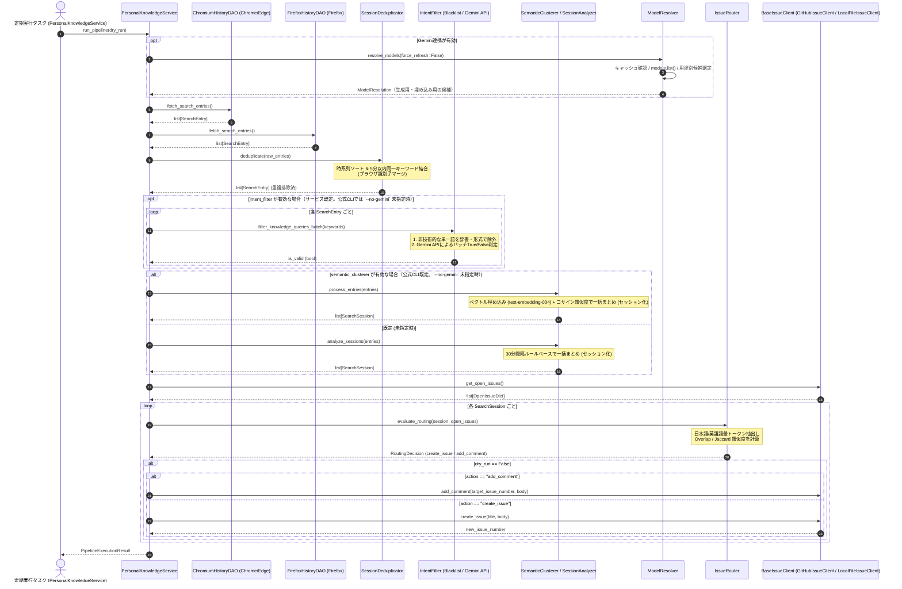

# 詳細設計書（ブラウザ検索履歴収集・セッション解析・Issueルーティング仕様）
**検索履歴収集(DAO)・重複排除/セッション解析(Domain)・Issueルーティング(Integration)仕様**

| 項目           | 内容                                                                      |
| :------------- | :------------------------------------------------------------------------ |
| 文書番号       | KNB-DD-008                                                                |
| ドキュメント名 | 詳細設計書（ブラウザ検索履歴収集・セッション解析・Issueルーティング仕様） |
| 版数           | Rev.1.8（Geminiモデル解決・フォールバック基盤の実装反映）                 |
| 改訂日         | 2026-08-28                                                                |
| 作成日         | 2026-08-23                                                                |
| 作成者         | 開発チーム                                                                |

---

## 1. 目的とスコープ

本書は、本システムにおける関数呼び出し順序・制御フロー・状態遷移ルーティング・DTOスキーマ・エラー対処契約の正本 (SSOT) とする。ストレージ構造や永続化スキーマ（DAO/State正本）については「データ構造仕様書 (KNB-DS-002)」を参照する。

本ドキュメントは、パーソナル・ナレッジ自動生成システムにおいて以下の具象モジュール仕様を規定する。

1. **データアクセス層 (DAO)**: Chrome, Edge, Firefox からの安全なSQLite読み込みと検索クエリ抽出
2. **ビジネスロジック層 (Domain)**:
   - 時系列5分以内重複排除 (`SessionDeduplicator`)
   - クエリ意図判定フィルタ (`IntentFilter`: 動的一単語判定＋Gemini APIによるバッチLLM判定)
   - 30分セッション分割 (`SessionAnalyzer`) および ベクトル埋め込みクラスタリング (`SemanticClusterer`: `models/text-embedding-004`＋コサイン類似度)
3. **連携層 (Integration)**: Jaccard / Szymkiewicz-Simpson Overlap 係数に基づく Open Issue へのルーティング、および `BaseIssueClient`（GitHub REST API / ローカルJSONストレージ）抽象化

---

## 2. 処理フローとシーケンス

---

## 3. レイヤー別具象仕様

### 3.1 データモデル (DTO)

本モジュール群で受け渡しされるDTOのフィールド仕様を以下に示す。本書を各DTOのSSOT（正本）とする。

#### ① `SearchEntry`（ブラウザから抽出された単一検索クエリ）
| フィールド名     | データ型   | 必須性 | デフォルト値 | 説明                                                                               |
| :--------------- | :--------- | :----: | :----------- | :--------------------------------------------------------------------------------- |
| `timestamp`      | `datetime` |  必須  | なし         | 検索が実行されたUTC日時                                                            |
| `keyword`        | `str`      |  必須  | なし         | 検索キーワード文字列                                                               |
| `source_browser` | `str`      |  必須  | なし         | 取得元ブラウザ識別子 (`chrome`, `edge`, `firefox`)。重複統合時はカンマ区切りで結合 |

#### ② `SearchSession`（30分以内の連続検索または意味的クラスタで構成されるセッション）
| フィールド名      | データ型    | 必須性 | デフォルト値 | 説明                                              |
| :---------------- | :---------- | :----: | :----------- | :------------------------------------------------ |
| `start_time`      | `datetime`  |  必須  | なし         | セッション内の最古クエリ検索日時                  |
| `end_time`        | `datetime`  |  必須  | なし         | セッション内の最新クエリ検索日時                  |
| `queries`         | `list[str]` |  必須  | なし         | セッションに含まれる一連のクエリリスト（2件以上） |
| `source_browsers` | `list[str]` |  任意  | 空リスト     | セッションに関与したブラウザ識別子のリスト        |

#### ③ `RoutingDecision`（ルーティング判定結果）
| フィールド名          | データ型      | 必須性 | デフォルト値 | 説明                                                               |
| :-------------------- | :------------ | :----: | :----------- | :----------------------------------------------------------------- |
| `action`              | `str`         |  必須  | なし         | `'create_issue'`（新規起票）または `'add_comment'`（コメント追記） |
| `target_issue_number` | `int \| None` |  必須  | `None`       | コメント追記先Issue番号（`action == 'add_comment'` の場合）        |
| `similarity_score`    | `float`       |  必須  | なし         | 最大類似度スコア (0.0〜1.0)                                        |
| `title`               | `str`         |  必須  | なし         | 新規起票時のタイトル（`add_comment` 時は空文字）                   |
| `body`                | `str`         |  必須  | なし         | 起票本文または追記コメント本文                                     |

#### ④ `ModelResolution`（モデル選定および実利用履歴）
| フィールド名       | データ型      | 必須性 | デフォルト値 | 説明                                                       |
| :----------------- | :------------ | :----: | :----------- | :--------------------------------------------------------- |
| `purpose`          | `str`         |  必須  | なし         | `generate_content` または `embed_content`                  |
| `selected_model`   | `str \| None` |  必須  | `None`       | 当該実行で実際に利用したモデル名。未解決時は `None`        |
| `candidate_source` | `str`         |  必須  | なし         | `api_discovery`、`cache`、`configured_fallback` のいずれか |
| `fallback_count`   | `int`         |  必須  | `0`          | 初期候補から切り替えた回数                                 |
| `fallback_reasons` | `list[str]`   |  必須  | 空リスト     | 404、429、タイムアウト等の候補切替理由。認証情報は含めない |
| `resolved_at`      | `datetime`    |  必須  | なし         | モデル候補を解決したUTC日時                                |

---

### 3.2 データアクセス層 (DAO) 仕様

#### ① パス解決とハードコード定義
外部からのファイルパス指定は排除し、各ブラウザの標準プロファイルパスをコード内に定義する。

| ブラウザ | 基準環境変数   | 相対パス                                                   | 補足                                                      |
| :------- | :------------- | :--------------------------------------------------------- | :-------------------------------------------------------- |
| Chrome   | `LOCALAPPDATA` | `Google/Chrome/User Data/Default/History`                  | 固定パス                                                  |
| Edge     | `LOCALAPPDATA` | `Microsoft/Edge/User Data/Default/History`                 | 固定パス                                                  |
| Firefox  | `APPDATA`      | `Mozilla/Firefox/Profiles/*.default-release/places.sqlite` | プロファイル名が可変のため `*.default-release` 配下を探索 |

#### ② 安全コピーとサイレントエラー
* `shutil.copy2` を使用して `tempfile.TemporaryDirectory` 配下に複製。
* コピー時やクエリ実行時の `IOError`, `sqlite3.Error` 等の例外は捕捉し、ログ記録の上で空リスト `[]` を返却する（サイレント障害復旧）。

#### ③ URLパース仕様
* `https://www.google.com/search?q=...` 等から `q` パラメータを抽出。
* デコード処理（`urllib.parse.unquote_plus`）を行い、前後の空白を除去。

---

### 3.3 ビジネスロジック層 (Domain) 仕様

#### ① 重複排除モジュール (`Deduplicator`)
* **入力**: `list[SearchEntry]`（複数ブラウザの合算リスト）
* **手順**:
  1. `timestamp` 昇順でソート。
  2. 直前のエントリと比較し、以下を判定：
     - キーワード正規化（大文字小文字・前後の空白を無視）が一致
     - かつ `(current.timestamp - prev.timestamp).total_seconds() <= 300` (5分以内)
  3. 一致した場合、直前のエントリにマージ（`source_browser` が異なればカンマ区切り等で結合、タイムスタンプは最新または開始時を保持）。
* **出力**: 重複排除された `list[SearchEntry]`

#### ② 意図判定フィルタリング (`IntentFilter.filter_knowledge_queries_batch`)
* **目的**: 文脈を持たない非技術的な単一語を早期に除外し、それ以外の検索クエリをGemini APIで一括判定する。
* **有効化方式**:
  - `PersonalKnowledgeService` を直接生成する場合、`intent_filter` を未指定または `IntentFilter` のインスタンス指定にすると有効となる。無効化する場合は `intent_filter=False` を明示指定する。
  - 公式コレクタCLIではGemini連携が既定で有効であり、`--no-gemini` 指定時だけ無効となる。
* **手順**:
  1. **単一語の早期除外 (`is_single_token_non_tech`)**: 空文字、技術キーワード辞書にない単一トークンを `False` とする。オプション形式（例: `--flag`）およびバージョン形式（例: `v1.2.3`）は判定対象から除外せず、Gemini判定へ送る。
  2. **LLM意図判定 (`judge_batch_with_llm`)**: 判定対象を最大50件ずつまとめ、`ModelResolver` が `generateContent` 対応モデルから解決した候補順で `google-genai` SDK (`google.genai.Client`) へ送信する。404時は候補キャッシュを無効化して次候補へ切り替え、429時は限定回数の待機・リトライ後に次候補を試行する。
  3. **レスポンス判定**: JSON形式の `{"1": true, "2": false}` を読み取り、各クエリに対応する真偽値を返す。
  4. **エラー時フォールバック**: `GEMINI_API_KEY` 未設定、全候補モデルの失敗、またはレスポンス処理の失敗時は、収集処理を止めない可用性優先の既定値として対象クエリを `True`（通過）とする。

#### ③ セッション解析・クラスタリング (`SessionAnalyzer` / `SemanticClusterer`)
* **ルールベース方式 (`SessionAnalyzer`)**: 既定で使用される方式。
  - 時系列順に走査し、直前のクエリとの時間間隔が **30分（1,800秒）以内** であれば同一セッションに追加。クエリ数が1件のみの単発検索はノイズとみなし破棄。
* **ベクトル埋め込み方式 (`SemanticClusterer.process_entries`)**: `PersonalKnowledgeService` のオプション引数 `semantic_clusterer` にインスタンスを渡した場合、`SessionAnalyzer` の代わりに使用される（公式コレクタCLIでは既定で有効、`--no-gemini` 指定時は無効）。
  - `ModelResolver` が `embedContent` 対応モデルから解決した候補を用いて、`google-genai` SDK の `client.models.embed_content(model=embed_model, contents=keyword)` を呼び出す。404時は次候補へ切り替え、API失敗時はゼロベクトル（空リスト）にフォールバックする。
  - **クラスタリングアルゴリズム（貪欲最近傍法）**: 時系列順に走査し、各エントリのベクトルと、既存の全クラスタの代表ベクトル（各クラスタの先頭エントリのベクトル）とのコサイン類似度を総当たりで計算する。最大類似度が閾値 (`similarity_threshold`, 既定 `0.70`) 以上であれば最も類似度が高いクラスタに追加し、閾値未満（または既存クラスタが無い）場合は新規クラスタを作成する。
  - コサイン類似度は `(A・B) / (|A| × |B|)` で計算し、いずれかがゼロベクトルの場合は `0.0` を返す（ゼロ除算回避）。
  - 各クラスタから `SearchSession`（開始/終了日時、クエリ一覧、関与ブラウザ一覧）を生成する。単発（1件のみ）クラスタも破棄せずセッション化する点が `SessionAnalyzer` と異なる。

---

### 3.4 連携層 (Integration) 仕様

#### ① Issue クライアント抽象化 (`BaseIssueClient`)
異なるストレージバックエンド（GitHub API / ローカルJSON）を統一的に操作するための抽象インターフェース。実装クラスは以下の抽象メンバー全てを実装する契約とする。

| メンバー名        | 種別           | 引数                                     | 戻り値                 | 説明                                                   |
| :---------------- | :------------- | :--------------------------------------- | :--------------------- | :----------------------------------------------------- |
| `is_configured`   | 抽象プロパティ | なし                                     | `bool`                 | クライアントが利用可能な状態か（認証情報設定済みか等） |
| `get_open_issues` | 抽象メソッド   | なし                                     | `list[dict[str, Any]]` | Open状態のIssue一覧を取得                              |
| `create_issue`    | 抽象メソッド   | `title: str`, `body: str`                | `int \| None`          | 新規Issueを起票し、起票番号を返却（失敗時 `None`）     |
| `add_comment`     | 抽象メソッド   | `issue_number: int`, `comment_body: str` | `bool`                 | 既存Issueにコメントを追記、成功時 `True`               |
| `close_issue`     | 抽象メソッド   | `issue_number: int`                      | `bool`                 | Issueをクローズ状態に変更、成功時 `True`               |

##### 実装1: `GitHubIssueClient`
- GitHub REST API (`https://api.github.com/repos/{owner}/{repo}/issues`) を通じて Issue の取得・起票・コメント追記を行う。
- 認証: `Authorization: Bearer <GITHUB_TOKEN>`
- 環境変数 `GITHUB_REPOSITORY` および `GITHUB_TOKEN` を参照。

##### 実装2: `LocalFileIssueClient`
- GitHub に依存せず、ローカル JSON ファイル (`data/personal_knowledge_issues.json`) またはメモリ上で Issue データを保持・更新する。
- 自動インクリメント ID 発行、永続化・再読み込み機能を搭載。

#### ② モデル解決・フォールバック (`ModelResolver`)
> **実装済み**: `ModelResolver` は、固定候補モデル方式を置き換え、動的モデル一覧取得・用途別候補解決・TTLキャッシュ・障害別フォールバックを提供する。

本コンポーネントはGemini APIで利用可能なモデルを検出し、意図判定とEmbeddingの用途ごとに実行候補を解決する。実行中の各クエリ処理は解決済み候補だけを利用し、モデル一覧APIを繰り返し呼び出してはならない。

| 項目       | 仕様                                                                                                                                                                              |
| :--------- | :-------------------------------------------------------------------------------------------------------------------------------------------------------------------------------- |
| 一覧取得   | `client.models.list()` を利用し、起動時・キャッシュTTL切れ時（既定86,400秒）・404検知時・明示更新時だけモデル一覧を更新する。                                                     |
| 用途別選別 | 意図判定用は `generateContent`、Embedding用は `embedContent` に対応するモデルだけを対象にする。両用途の候補リストは混在させない。                                                 |
| 優先順位   | 許可リスト・プレビュー版許可設定で対象を絞り、安定版を優先して数値バージョンを降順に並べる。リリース日時をAPIから得られないため、名前の単純な辞書順を「最新順」として使用しない。 |
| 緊急候補   | 一覧取得不能時は設定ファイルの `chat_model_candidates` または `embed_model_candidates` を順に試す。このリストは動的検出失敗時だけに使用する。                                     |
| 結果記録   | 実利用モデル、候補の取得元、フォールバック回数・理由を `ModelResolution` に格納し、`PipelineExecutionResult`、JSON出力、ログへ渡す。Issue本文への表示は設定で有効化する。         |

**候補切替契約**:
- 404 / `NOT_FOUND`: 選択済み候補を無効化し、モデル一覧を再取得した上で次候補を試す。
- 429 / `RESOURCE_EXHAUSTED`: 指数的な待機で限定回数リトライ後、次候補を試す。
- タイムアウト・5xx: 限定回数リトライ後、次候補を試す。
- 400・401・403: リクエスト形式、APIキー、権限の不備として即時に失敗を返す。候補切替で隠蔽しない。

#### ③ Issue ルーティング判定 (`IssueRouter`)
* **単語トークナイズ**:
  - 英数字単語、カタカナ単語、漢字連続語、日本語フレーズを正規化抽出し、ノイズワード（ストップワード）を除去。
* **類似度計算アルゴリズム**: Szymkiewicz-Simpson Overlap 係数 / Jaccard 係数
  $$ \text{Overlap}(A, B) = \frac{|A \cap B|}{\min(|A|, |B|)}, \quad \text{Coverage}(A, B) = \frac{|A \cap B|}{|A|} $$
  $$ \text{Score} = \max(\text{Coverage}, \text{Overlap}, \text{Jaccard}) $$
* **ルーティング分岐**:
  - `max_similarity >= similarity_threshold` (標準閾値: 0.3): 最大類似度の Issue にコメントとしてセッション内容を追記。
  - `max_similarity < 0.3`: 新規 Issue を作成。
    - タイトル: `[自動抽出] <代表クエリ> 関連の調査`
    - 本文: 開始日時、終了日時、検出ブラウザ、検索クエリ一覧。

---

## 4. エラーハンドリングと例外設計

| 発生レイヤー       | 想定異常事象                           | 処置                                                                                                                                                                                                   |
| :----------------- | :------------------------------------- | :----------------------------------------------------------------------------------------------------------------------------------------------------------------------------------------------------- |
| **DAO層**          | ブラウザ起動中によるDBロック           | 一時コピーにより回避。コピー自体の失敗時はサイレントにスキップ                                                                                                                                         |
| **モデル解決基盤** | 一覧取得失敗 / 選択済みモデルの404     | TTL内キャッシュを利用し、一覧取得失敗時は設定済み緊急候補へ切替。404時は候補キャッシュを無効化して再解決する。                                                                                         |
| **Domain層**       | Gemini API 意図判定/埋め込みエラー     | `IntentFilter.judge_batch_with_llm` / `SemanticClusterer._embed_text` は `ModelResolver` の候補切替契約に従う。全候補失敗時は、意図判定は `True`（通過）、埋め込みは空リスト（ゼロベクトル相当）を返却 |
| **モデル解決基盤** | 400 / 401 / 403                        | リクエスト、認証、権限の不備として明示的に失敗を返す。モデル候補の切替は行わない。                                                                                                                     |
| **Integration層**  | GitHub API トークン未設定 / 通信エラー | ログ記録し `LocalFileIssueClient` へのフォールバックまたは次回実行へ延期                                                                                                                               |

---

## 5. 単体テスト要件

1. **DAO層テスト (`test_personal_knowledge_dao.py`)**:
   - SQLiteモックファイルを作成し、WebKit時間/PRTimeの変換、URLからのクエリ抽出を検証。
2. **重複排除・セッション解析テスト (`test_personal_knowledge_domain.py`)**:
   - 5分以内の同一キーワード結合、30分間隔ルールベースセッション分割を検証。
3. **意図判定フィルタテスト (`test_intent_filter.py`)**:
   - 非技術的な単一語がLLM呼び出しなしで除外されること、Gemini APIモックによる `True`/`False` 判定を検証。
   - `GEMINI_API_KEY` 未設定時およびAPI例外時に、処理継続のため `True` へフォールバックすることを検証。
4. **意味的クラスタリングテスト (`test_semantic_clusterer.py`)**:
   - コサイン類似度関数（同一/直交/ゼロベクトル）、Embeddingモックによるセッション統合、API例外時に空リストへフォールバックすることを検証。
5. **Issueクライアントテスト (`test_local_file_client.py`)**:
   - `LocalFileIssueClient` のメモリ動作および JSON ファイルへのデータ読み書き・永続化を検証。
6. **ルーティング・オーケストレーションテスト (`test_personal_knowledge_router.py` / `test_personal_knowledge_service.py` / `test_service_intent_and_clustering.py`)**:
   - 語彙トークナイズおよび Overlap / Jaccard 類似度計算の検証。
   - `PersonalKnowledgeService` での `IntentFilter` の既定有効化、`intent_filter=False` による無効化、および `SemanticClusterer` の明示指定時だけ意味的クラスタリングを行うことを検証。
7. **設定ファイル読み込みテスト (`test_config_loader.py`)**:
   - 設定ファイル欠落時・不正JSON時にデフォルト値へフォールバックすること、カスタム値の読み込みを検証。
8. **モデル解決基盤テスト (`test_model_resolver.py`)**:
   - `models.list()` のモックから、`generateContent` / `embedContent` の用途別選別、安定版・数値バージョン順の優先順位、TTLキャッシュを検証。
   - 一覧取得失敗時の設定済み緊急候補への切替、404時の再解決、429・5xx時のリトライ後の候補切替、400・401・403で候補切替しないことを検証。
   - `ModelResolution` に実利用モデル、候補の取得元、フォールバック回数・理由が記録されることを検証。

---

## 6. 改訂履歴 (Change Log)

| 版数    | 改訂日     | 変更者     | 変更内容・変更理由 (Why)                                                                                                                             |
| :------ | :--------- | :--------- | :--------------------------------------------------------------------------------------------------------------------------------------------------- |
| Rev.1.0 | 2026-08-23 | 開発チーム | 新規作成（ブラウザ履歴収集・セッション解析・Issueルーティング詳細設計初版制定）                                                                      |
| Rev.1.1 | 2026-08-25 | 開発チーム | `BaseIssueClient` 抽象化、`LocalFileIssueClient` 詳細、Overlap/Jaccardハイブリッド類似度仕様の反映                                                   |
| Rev.1.2 | 2026-08-25 | 開発チーム | Google Gemini API (`gemini-1.5-flash`, `text-embedding-004`) によるクエリ意図判定フィルタおよびコサイン類似度意味的クラスタリング仕様の反映          |
| Rev.1.3 | 2026-08-25 | 開発チーム | 規約違反修正: DTO定義・パス定義・`BaseIssueClient`インターフェースのコード直貼りをテーブル形式に変更し、SSOT宣言文を追加                             |
| Rev.1.4 | 2026-08-25 | 開発チーム | 実装反映: `IntentFilter`/`SemanticClusterer`（`google-genai` SDK使用）の実装詳細、`PersonalKnowledgeService`へのオプトイン統合方式、テスト構成を明記 |
| Rev.1.5 | 2026-08-27 | 開発チーム | 実装反映: Mypy型アノテーション(42件)の補正・`google.genai`事前インポートテスト修正・Ruffフォーマットの反映                                           |
| Rev.1.6 | 2026-08-28 | 開発チーム | 実装整合: Gemini連携の既定有効化、`--no-gemini`による無効化、動的一単語判定、バッチ判定、およびAPI未設定・障害時の通過フォールバックを反映           |
| Rev.1.7 | 2026-08-28 | 開発チーム | 設計追加: `ModelResolver` による動的モデル一覧取得、用途別候補選別、TTLキャッシュ、障害別フォールバック、実利用モデル記録を追加                      |
| Rev.1.8 | 2026-08-28 | 開発チーム | 実装反映: `ModelResolver`、用途別候補選別、TTLキャッシュ、障害別フォールバック、CLIの実利用モデル出力、設定スキーマを追加                            |
