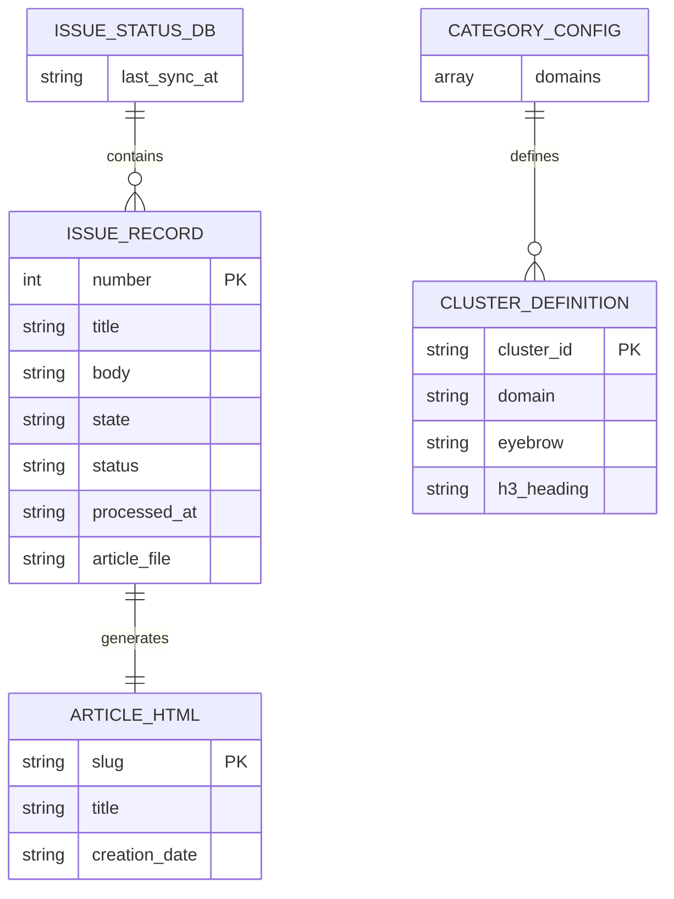

# データ構造仕様書（永続化データスキーマ・ファイル状態管理仕様）
**データ構造・JSONスキーマ・永続化保存契約**

| 項目 | 内容 |
| :--- | :--- |
| 文書番号 | KNB-DS-001 |
| ドキュメント名 | データ構造仕様書（永続化データスキーマ・ファイル状態管理仕様） |
| 版数 | Rev.1.1 |
| 改訂日 | 2026-08-15 |
| 作成日 | 2026-08-13 |
| 作成者 | 開発チーム |

---

## 1. 概要とデータ管理方針

### 1.1 管理対象データの目的
本設計書は、本システムで永続化保存されるローカルJSONデータベース（`data/issue_status.json`）、外部カテゴリ設定（`config/category_config.json`）、およびビルド出力されるデータ構造のスキーマと永続化ルールを規定する。

### 1.2 データ境界 (DAO / 永続化ストレージ正本)
- **データアクセス・永続化正本 (DAO / State)**: 本書はディスクに物理保存されるJSONデータのプロパティ構造・データ型・状態タクソノミーの正本とする。
- **DTOとの使い分け**: 関数の引数・戻り値等のメモリ上データ構造については「詳細設計書 (DD)」を参照すること。

---

## 2. データモデルおよび JSON スキーマ仕様

### 2.1 データエンティティモデル (Mermaid ER図)

### 2.2 GitHub Issue ローカル同期データスキーマ (`data/issue_status.json`)

| フィールド名 | データ型 | 必須性 | デフォルト値 | フィールドの意味・制約条件 |
| :--- | :--- | :---: | :--- | :--- |
| `last_sync_at` | 文字列 (ISO8601) | 任意 | `null` | 前回 GitHub API と差分同期（since）を行った最終日時 |
| `issues` | オブジェクト | 必須 | `{}` | Issue 番号文字列をキーとする Issue レコード辞書 |
| `issues.<id>.number` | 数値 (int) | 必須 | - | GitHub Issue の一意な番号 |
| `issues.<id>.title` | 文字列 | 必須 | - | Issue のタイトルテキスト |
| `issues.<id>.body` | 文字列 | 任意 | `""` | Issue の本文テキスト |
| `issues.<id>.state` | 文字列 | 必須 | `"open"` | GitHub 上の状態 (`open` / `closed`) |
| `issues.<id>.status` | 文字列 (Enum) | 必須 | `"unprocessed"` | 処理状態 (`unprocessed`, `processing`, `processed`, `failed`) |
| `issues.<id>.processed_at` | 文字列 (ISO8601) | 任意 | `null` | 記事生成が完了した日時 |
| `issues.<id>.article_file` | 文字列 | 任意 | `null` | 生成された記事 HTML のスラッグファイル名 (例: `issue-12-test.html`) |
| `issues.<id>.article_source_file` | 文字列 | 任意 | `null` | 保存された Markdown 原本ファイル名 (例: `issue-12.md`) |
| `issues.<id>.index_synced` | 真偽値 (bool) | 必須 | `false` | インデックス (`docs/index.html`) への同期完了状態 |
| `issues.<id>.attempt_id` | 文字列 (UUID) | 任意 | `null` | 処理試行ごとの一意な識別子 |
| `issues.<id>.failed_at` | 文字列 (ISO8601) | 任意 | `null` | 処理が失敗した日時 |
| `issues.<id>.failure_reason` | 文字列 | 任意 | `null` | 失敗の例外種別・処理段階・要約メッセージ |

### 2.3 カテゴリ・クラスタ定義スキーマ (`config/category_config.json`)

| フィールド名 | データ型 | 必須性 | フィールドの意味・制約条件 |
| :--- | :--- | :---: | :--- |
| `clusters` | オブジェクト | 必須 | クラスタIDをキーとする定義オブジェクト |
| `clusters.<id>.domain` | 文字列 | 必須 | 属する大カテゴリドメイン (`dev`, `game`, `ai`, `infra`) |
| `clusters.<id>.eyebrow` | 文字列 | 必須 | 記事の `.eyebrow` と完全一致判定されるカテゴリ表記 (例: `開発 > バックエンド & API`) |
| `clusters.<id>.h3` | 文字列 | 必須 | index.html に出力される見出し文字列 |
| `cluster_order` | リスト (string) | 必須 | ドメイン内での表示優先順リスト |

---

## 3. 永続化・原子置換契約・排他制御

### 3.1 原子的書き込み契約 (Atomic Write Contract)
JSONデータの更新時は、途中で書き込みが失敗して破壊されることを防ぐため、以下の手順を実行する。

1. メモリ上でデータ構造を検証・シリアライズ
2. 同一ディレクトリに一時ファイル生成 (`data/issue_status.json.tmp`)
3. アトミックな置換処理 (`os.replace` やファイルシステム置換) を用いて正本ファイルを上書き更新

---

## 4. 改訂履歴 (Change Log)

| 版数 | 改訂日 | 変更者 | 変更内容・変更理由 (Why) |
| :--- | :--- | :--- | :--- |
| Rev.1.0 | 2026-08-13 | 開発チーム | 新規作成（TEMPLATE_データ構造仕様書.mdに基づく初版制定） |
| Rev.1.1 | 2026-08-15 | 開発チーム | ドキュメント間整合性レビュー反映：KNB-DD-002への相互参照を追加 |
