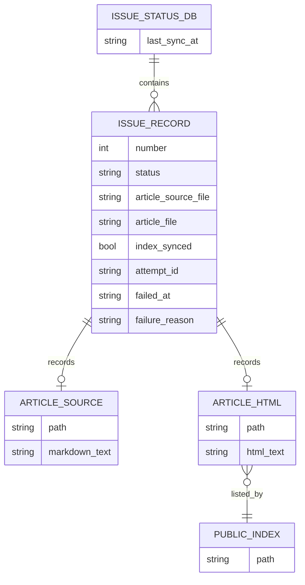

# データ構造仕様書（永続化データスキーマ・ファイル状態管理仕様）
| 項目     | 内容       |
| :------- | :--------- |
| 文書番号 | KNB-DS-001 |
| 版数     | Rev.1.2    |
| 改訂日   | 2026-08-31 |

## 1. 永続化モデル

`issue_status.json`がIssue処理状態の正本である。Markdown原本は`data/article_sources/issue-<番号>.md`、HTML記事は`public/articles/<filename>`、indexは`public/index.html`に保存する。

## 2. Issueレコードスキーマ
| フィールド                   | 型                    | 既定値        | 制約・意味                                             |
| :--------------------------- | :-------------------- | :------------ | :----------------------------------------------------- |
| `number` / `title` / `state` | int / string / string | なし          | GitHub Issue番号、題名、`open`または`closed`。         |
| `body`                       | string                | `""`          | Issue本文。                                            |
| `status`                     | enum                  | `unprocessed` | `unprocessed`、`processing`、`processed`、`failed`。   |
| `processed_at`               | ISO8601文字列         | null          | 完了記録時刻。                                         |
| `article_source_file`        | string                | null          | Markdown原本名。                                       |
| `article_file`               | string                | null          | 記事HTML名。                                           |
| `index_synced`               | bool                  | false         | index同期を完了として記録した値。                      |
| `attempt_id`                 | UUID文字列            | null          | 処理試行ID。                                           |
| `failed_at`                  | ISO8601文字列         | null          | 失敗記録時刻。                                         |
| `failure_reason`             | string                | null          | 段階と利用者向け要約。秘密情報・応答全文は保存しない。 |

## 3. 原子的書込み契約と実装状況
`atomic_write_text`は同一ディレクトリの`<対象>.tmp`へUTF-8（BOMなし）・LFで書込み、flush・fsync後に`os.replace`する。失敗時は一時ファイルを削除し、例外を呼出元へ返す。`atomic_write_json`はJSON文字列化後に同契約を利用する。

| 対象                     | 保存方式            | 状態                                       |
| :----------------------- | :------------------ | :----------------------------------------- |
| `data/issue_status.json` | `atomic_write_json` | 実装済み                                   |
| Markdown原本             | `atomic_write_text` | 実装済み                                   |
| 記事HTML                 | `atomic_write_text` | 実装済み                                   |
| `public/index.html`      | 通常の上書き        | 原子的書込み・保存後検証は未対応の追跡事項 |

この契約は単一同期プロセスを前提とし、複数プロセス間のロックは提供しない。

## 4. 後方互換性
旧レコードに追加フィールドが存在しない場合、読取り上は`article_source_file`、`attempt_id`、`failed_at`、`failure_reason`を`null`、`index_synced`を`false`として扱う。欠損フィールドだけを根拠に既存の`status`や成果物情報を変更しない。書込み時に追加フィールドを持つ新スキーマへ更新できる。

## 5. 改訂履歴
| 版数    | 改訂日     | 変更内容                                                                  |
| :------ | :--------- | :------------------------------------------------------------------------ |
| Rev.1.1 | 2026-08-15 | 文書間整合性レビュー反映                                                  |
| Rev.1.2 | 2026-08-31 | ER図、実装済みの原子的書込み範囲、index追跡事項、既存レコード互換性を更新 |
