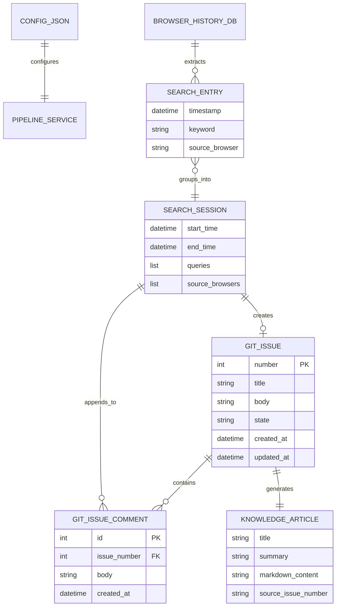

# データ構造仕様書（パーソナル・ナレッジデータスキーマ・キュー定義）
**DTOデータモデル・設定JSONスキーマ・Issue/ローカルキューメッセージ構造・永続化スキーマ**

| 項目 | 内容 |
| :--- | :--- |
| 文書番号 | KNB-DS-002 |
| ドキュメント名 | データ構造仕様書（パーソナル・ナレッジデータスキーマ・キュー定義） |
| 版数 | Rev.1.1 (config.json スキーマ定義の反映) |
| 改訂日 | 2026-08-25 |
| 作成日 | 2026-08-23 |
| 作成者 | 開発チーム |

---

## 1. 概要とデータ管理方針

### 1.1 管理対象データの目的
本設計書は、パーソナル・ナレッジ自動生成システムでやり取りされるメモリ上のDTO（`SearchEntry`, `SearchSession`）、パイプライン外部設定ファイル (`config.json`)、およびタスクキュー（Git Issue または ローカルJSON）のフォーマットスキーマを定義する。

### 1.2 データ境界方針
- **メモリ上データ (DTO)**: DAO層、Domain層、Integration層間のパラメータ受け渡し用。
- **設定データ (`config.json`)**: API連携、フィルタリングプロンプト、ブラックリスト、類似度閾値の外部定義。
- **タスクキュー (Git Issue / Local JSON)**: 検索セッションの蓄積・結合・LLM生成トリガーの状態保持正本。
- **永続化ナレッジ (Markdown)**: LLMにより生成され、最終的にナレッジベースとして保存される記事ファイル。

---

## 2. データエンティティモデル (Mermaid ER図)



---

## 3. 詳細スキーマ仕様

### 3.1 DTO スキーマ (Python Dataclass)

#### ① `SearchEntry` (検索クエリ単位)
| フィールド名 | データ型 | 必須性 | 説明 |
| :--- | :--- | :---: | :--- |
| `timestamp` | `datetime` | 必須 | 検索が実行されたUTC日時 |
| `keyword` | `str` | 必須 | 正規化された検索キーワード文字列 |
| `source_browser` | `str` | 必須 | 取得元ブラウザ種別 (`chrome`, `edge`, `firefox`) |

#### ② `SearchSession` (セッション単位)
| フィールド名 | データ型 | 必須性 | 説明 |
| :--- | :--- | :---: | :--- |
| `start_time` | `datetime` | 必須 | セッション内の最古クエリ検索日時 |
| `end_time` | `datetime` | 必須 | セッション内の最新クエリ検索日時 |
| `queries` | `list[str]` | 必須 | セッションに含まれる一連のクエリリスト（2件以上） |
| `source_browsers` | `list[str]` | 必須 | セッションに関与したブラウザ識別子のリスト |

---

### 3.2 パイプライン設定ファイル・スキーマ (`config.json`)

外部からパイプラインの動作挙動、APIモデル指定、意図判定フィルタリングルール、類似度閾値を制御するJSONスキーマ。

```json
{
  "api": {
    "provider": "gemini",
    "chat_model": "gemini-1.5-flash",
    "embed_model": "models/text-embedding-004"
  },
  "clustering": {
    "similarity_threshold": 0.70
  },
  "filtering": {
    "blacklisted_keywords": ["天気", "乗り換え", "ログイン", "amazon", "youtube", "マップ"],
    "llm_system_prompt": "あなたは検索クエリの意図を分類するアシスタントです。提示された検索クエリが『知識の習得、概念の理解、単語の意味の調査、技術的な問題解決』を目的としている場合は 'True' を出力してください。単なるサイトへの移動（ナビゲーション）、エンタメの消費、日常タスク（天気やルート検索）が目的である場合は 'False' を出力してください。出力は True または False のみとし、他の文字列を含めないでください。"
  },
  "github": {
    "owner": "owner_name",
    "repo": "repo_name",
    "issue_similarity_threshold": 0.30
  }
}
```

| セクション | キー名 | データ型 | デフォルト値 | 説明 |
| :--- | :--- | :--- | :--- | :--- |
| `api` | `provider` | `str` | `"gemini"` | LLM/Embeddingプロバイダ種別 (`"gemini"`, `"ollama"`) |
| `api` | `chat_model` | `str` | `"gemini-1.5-flash"` | 意図判定用チャットLLMモデル名 |
| `api` | `embed_model` | `str` | `"models/text-embedding-004"` | ベクトル埋め込みモデル名 |
| `clustering` | `similarity_threshold` | `float` | `0.70` | ベクトル埋め込みコサイン類似度セッション統合閾値 |
| `filtering` | `blacklisted_keywords` | `list[str]` | `[...]` | 即座に排除する非技術系日常検索キーワードリスト |
| `filtering` | `llm_system_prompt` | `str` | `"..."` | 意図判定時にGemini APIに与える二値分類システムプロンプト |
| `github` | `issue_similarity_threshold` | `float` | `0.30` | 既存Issueへのコメント追加判定時の語彙類似度閾値 |

---

### 3.3 Git Issue / ローカルタスクキュー・スキーマ

#### ① 新規 Issue 起票時のフォーマット
* **Title**: `[自動抽出] <最初のクエリ> 関連の調査`
* **Body テンプレート**:
```markdown
## 自動抽出された技術調査セッション

- **開始日時**: YYYY-MM-DD HH:MM:SS UTC
- **終了日時**: YYYY-MM-DD HH:MM:SS UTC
- **検出ブラウザ**: Chrome, Edge

### 検索クエリ一覧
1. Python asyncio タスクキャンセル 仕組み
2. asyncio.CancelledError ハンドリング
3. asyncio TaskGroup 例外伝播
```

#### ② 追記コメントのフォーマット
* **Comment Body テンプレート**:
```markdown
### 追加の調査セッション (検出日時: YYYY-MM-DD HH:MM:SS UTC)

- **検出ブラウザ**: Firefox
- **関連クエリ**:
  - Python asyncio wait_for タイムアウト
  - asyncio shield 挙動
```

---

## 4. 改訂履歴 (Change Log)

| 版数 | 改訂日 | 変更者 | 変更内容・変更理由 (Why) |
| :--- | :--- | :--- | :--- |
| Rev.1.0 | 2026-08-23 | 開発チーム | 新規作成（パーソナル・ナレッジデータスキーマおよびGit Issueキュー定義初版制定） |
| Rev.1.1 | 2026-08-25 | 開発チーム | Gemini API / 意図判定プロンプト / ブラックリスト / コサイン類似度設定用の `config.json` スキーマ定義を追加 |
