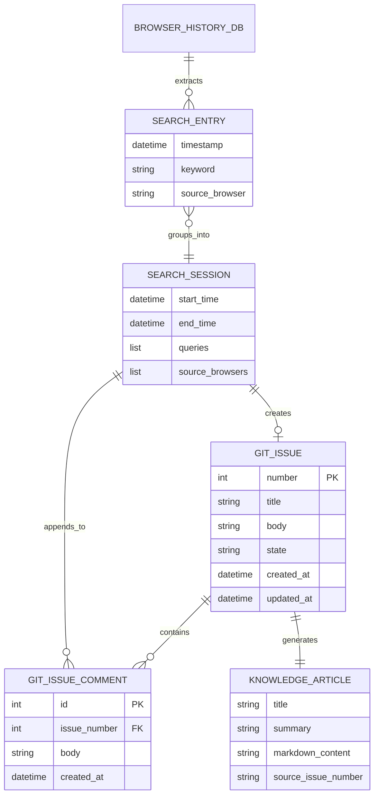

# データ構造仕様書（パーソナル・ナレッジデータスキーマ・キュー定義）
**DTOデータモデル・Git Issueキューメッセージ構造・永続化スキーマ**

| 項目 | 内容 |
| :--- | :--- |
| 文書番号 | KNB-DS-002 |
| ドキュメント名 | データ構造仕様書（パーソナル・ナレッジデータスキーマ・キュー定義） |
| 版数 | Rev.1.0 (新規作成) |
| 改訂日 | 2026-08-23 |
| 作成日 | 2026-08-23 |
| 作成者 | 開発チーム |

---

## 1. 概要とデータ管理方針

### 1.1 管理対象データの目的
本設計書は、パーソナル・ナレッジ自動生成システムでやり取りされるメモリ上のDTO（`SearchEntry`, `SearchSession`）、および揮発しないタスクキューとして機能する Git Issue のフォーマットスキーマを定義する。

### 1.2 データ境界方針
- **メモリ上データ (DTO)**: DAO層、Domain層、Integration層間のパラメータ受け渡し用。
- **タスクキュー (Git Issue)**: 検索セッションの蓄積・結合・LLM生成トリガーの状態保持正本。
- **永続化ナレッジ (Markdown)**: LLMにより生成され、最終的にナレッジベースとして保存される記事ファイル。

---

## 2. データエンティティモデル (Mermaid ER図)



---

## 3. 詳細スキーマ仕様

### 3.1 DTO スキーマ (Python Dataclass)

#### ① `SearchEntry` (検索クエリ単位)
| フィールド名 | データ型 | 必須性 | 説明 |
| :--- | :--- | :---: | :--- |
| `timestamp` | `datetime` | 必須 | 検索が実行されたUTC日時 |
| `keyword` | `str` | 必須 | 正規化された検索キーワード文字列 |
| `source_browser` | `str` | 必須 | 取得元ブラウザ種別 (`chrome`, `edge`, `firefox`) |

#### ② `SearchSession` (セッション単位)
| フィールド名 | データ型 | 必須性 | 説明 |
| :--- | :--- | :---: | :--- |
| `start_time` | `datetime` | 必須 | セッション内の最古クエリ検索日時 |
| `end_time` | `datetime` | 必須 | セッション内の最新クエリ検索日時 |
| `queries` | `list[str]` | 必須 | セッションに含まれる一連のクエリリスト（2件以上） |
| `source_browsers` | `list[str]` | 必須 | セッションに関与したブラウザ識別子のリスト |

---

### 3.2 Git Issue タスクキュー・スキーマ

#### ① 新規 Issue 起票時のフォーマット
* **Title**: `[自動抽出] <最初のクエリ> 関連の調査`
* **Body テンプレート**:
```markdown
## 自動抽出された技術調査セッション

- **開始日時**: YYYY-MM-DD HH:MM:SS UTC
- **終了日時**: YYYY-MM-DD HH:MM:SS UTC
- **検出ブラウザ**: Chrome, Edge

### 検索クエリ一覧
1. Python asyncio タスクキャンセル 仕組み
2. asyncio.CancelledError ハンドリング
3. asyncio TaskGroup 例外伝播
```

#### ② 追記コメントのフォーマット
* **Comment Body テンプレート**:
```markdown
### 追加の調査セッション (検出日時: YYYY-MM-DD HH:MM:SS UTC)

- **検出ブラウザ**: Firefox
- **関連クエリ**:
  - Python asyncio wait_for タイムアウト
  - asyncio shield 挙動
```

---

## 4. 改訂履歴 (Change Log)

| 版数 | 改訂日 | 変更者 | 変更内容・変更理由 (Why) |
| :--- | :--- | :--- | :--- |
| Rev.1.0 | 2026-08-23 | 開発チーム | 新規作成（パーソナル・ナレッジデータスキーマおよびGit Issueキュー定義初版制定） |
