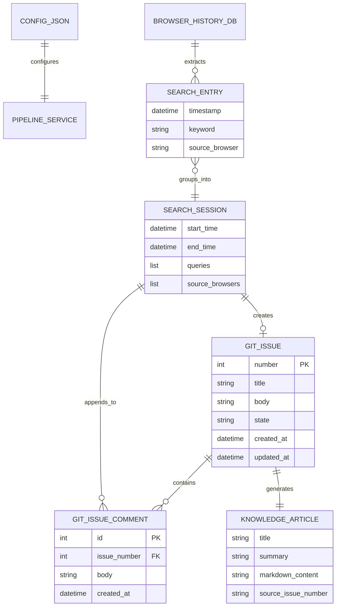

# データ構造仕様書（パーソナル・ナレッジデータスキーマ・キュー定義）
**DTOデータモデル・設定JSONスキーマ・Issue/ローカルキューメッセージ構造・永続化スキーマ**

| 項目           | 内容                                                               |
| :------------- | :----------------------------------------------------------------- |
| 文書番号       | KNB-DS-002                                                         |
| ドキュメント名 | データ構造仕様書（パーソナル・ナレッジデータスキーマ・キュー定義） |
| 版数           | Rev.1.3 (config.json実配置パスと読み込み実装の反映)                |
| 改訂日         | 2026-08-25                                                         |
| 作成日         | 2026-08-23                                                         |
| 作成者         | 開発チーム                                                         |

---

## 1. 概要とデータ管理方針

### 1.1 管理対象データの目的
本設計書は、パーソナル・ナレッジ自動生成システムでやり取りされるメモリ上のDTO（`SearchEntry`, `SearchSession`）、パイプライン外部設定ファイル (`config.json`)、およびタスクキュー（Git Issue または ローカルJSON）のフォーマットスキーマを定義する。

### 1.2 データ境界方針
- **メモリ上データ (DTO)**: DAO層、Domain層、Integration層間のパラメータ受け渡し用。
- **設定データ (`config.json`)**: API連携、フィルタリングプロンプト、ブラックリスト、類似度閾値の外部定義。
- **タスクキュー (Git Issue / Local JSON)**: 検索セッションの蓄積・結合・LLM生成トリガーの状態保持正本。
- **永続化ナレッジ (Markdown)**: LLMにより生成され、最終的にナレッジベースとして保存される記事ファイル。

---

## 2. データエンティティモデル (Mermaid ER図)



---

## 3. 詳細スキーマ仕様

### 3.1 DTO スキーマ (Python Dataclass)

#### ① `SearchEntry` (検索クエリ単位)
| フィールド名     | データ型   | 必須性 | 説明                                             |
| :--------------- | :--------- | :----: | :----------------------------------------------- |
| `timestamp`      | `datetime` |  必須  | 検索が実行されたUTC日時                          |
| `keyword`        | `str`      |  必須  | 正規化された検索キーワード文字列                 |
| `source_browser` | `str`      |  必須  | 取得元ブラウザ種別 (`chrome`, `edge`, `firefox`) |

#### ② `SearchSession` (セッション単位)
| フィールド名      | データ型    | 必須性 | 説明                                              |
| :---------------- | :---------- | :----: | :------------------------------------------------ |
| `start_time`      | `datetime`  |  必須  | セッション内の最古クエリ検索日時                  |
| `end_time`        | `datetime`  |  必須  | セッション内の最新クエリ検索日時                  |
| `queries`         | `list[str]` |  必須  | セッションに含まれる一連のクエリリスト（2件以上） |
| `source_browsers` | `list[str]` |  必須  | セッションに関与したブラウザ識別子のリスト        |

---

### 3.2 パイプライン設定ファイル・スキーマ (`config/personal_knowledge_config.json`)

外部からパイプラインの動作挙動、APIモデル指定、意図判定フィルタリングルール、類似度閾値を制御するJSONスキーマ。実装は `src/personal_knowledge/config_loader.py` の `load_config()` が担い、ファイル欠落時・不正JSON時はサイレントにデフォルト値 (`PersonalKnowledgeConfig()`) へフォールバックする。読み込まれた値は `IntentFilter` (`filtering` セクション) および `SemanticClusterer` (`api.embed_model`, `clustering.similarity_threshold`) に注入される。`github` セクションは現時点で `IssueRouter`/`GitHubIssueClient` への読み込み連携は未実装であり、将来の設定統合用に定義のみ先行している。

| セクション   | キー名                       | データ型    | デフォルト値                                                      | 説明                                                     |
| :----------- | :--------------------------- | :---------- | :---------------------------------------------------------------- | :------------------------------------------------------- |
| `api`        | `provider`                   | `str`       | `"gemini"`                                                        | LLM/Embeddingプロバイダ種別 (`"gemini"`, `"ollama"`)     |
| `api`        | `chat_model`                 | `str`       | `"gemini-1.5-flash"`                                              | 意図判定用チャットLLMモデル名                            |
| `api`        | `embed_model`                | `str`       | `"models/text-embedding-004"`                                     | ベクトル埋め込みモデル名                                 |
| `clustering` | `similarity_threshold`       | `float`     | `0.70`                                                            | ベクトル埋め込みコサイン類似度セッション統合閾値         |
| `filtering`  | `blacklisted_keywords`       | `list[str]` | `["天気", "乗り換え", "ログイン", "amazon", "youtube", "マップ"]` | 即座に排除する非技術系日常検索キーワードリスト           |
| `filtering`  | `llm_system_prompt`          | `str`       | （分類用システムプロンプト文字列）                                | 意図判定時にGemini APIに与える二値分類システムプロンプト |
| `github`     | `issue_similarity_threshold` | `float`     | `0.30`                                                            | 既存Issueへのコメント追加判定時の語彙類似度閾値          |

---

### 3.3 Git Issue / ローカルタスクキュー・スキーマ

#### ① 新規 Issue 起票時のフォーマット
* **Title**: `[自動抽出] <最初のクエリ> 関連の調査`
* **Body テンプレート**:
```markdown
## 自動抽出された技術調査セッション

- **開始日時**: YYYY-MM-DD HH:MM:SS UTC
- **終了日時**: YYYY-MM-DD HH:MM:SS UTC
- **検出ブラウザ**: Chrome, Edge

### 検索クエリ一覧
1. Python asyncio タスクキャンセル 仕組み
2. asyncio.CancelledError ハンドリング
3. asyncio TaskGroup 例外伝播
```

#### ② 追記コメントのフォーマット
* **Comment Body テンプレート**:
```markdown
### 追加の調査セッション (検出日時: YYYY-MM-DD HH:MM:SS UTC)

- **検出ブラウザ**: Firefox
- **関連クエリ**:
  - Python asyncio wait_for タイムアウト
  - asyncio shield 挙動
```

---

## 4. 永続化・原子置換契約・排他制御

### 4.1 ローカルタスクキューの永続化方式 (`LocalFileIssueClient`)
- **保存先**: `data/personal_knowledge_issues.json`（未指定時のデフォルト。空文字指定時はメモリのみで保持しファイル永続化を行わない）。
- **書き込み契約**: 起票・コメント追記・クローズの各操作後、Issueリスト全量を対象ファイルへ都度上書き保存する（`json.dump` による全量書き込み）。
- **読み込み契約**: 起動時にファイルが存在する場合のみ全量読み込みを行い、`number` フィールドの最大値+1を次回発行IDとして復元する。ファイルが存在しない、または読み込みに失敗した場合は空リストとして初期化する（サイレントフォールト）。

### 4.2 排他制御に関する制約事項
- 現状の `LocalFileIssueClient` はファイルロック（FileLock）や原子的置換（一時ファイル経由のアトミックリネーム）を実装していない。単一プロセスからの逐次実行を前提とし、複数プロセスからの同時書き込みは想定していない。
- 将来的に定期実行（スケジューラ）と手動実行が同時に走る運用を行う場合は、書き込み時の排他制御（FileLock等）の追加を検討する。

---

## 5. データ生命周期と互換性保全

### 5.1 フォーマット移行と互換性ルール
- **未知フィールドの許容**: `_load_data` はJSON配列内の各要素を `dict` として読み込むのみで、スキーマバリデーションは行わない。将来的にフィールドを追加した場合も、旧形式データ（新フィールド欠落）はそのまま読み込み可能（該当フィールド参照時は `.get()` によるデフォルト値フォールバックで対応）。
- **`state` フィールドの後方互換**: `state` キーが欠落しているレコードは `get_open_issues` 側で `"open"` として扱われる（デフォルト値フォールバック）。

---

## 6. 改訂履歴 (Change Log)

| 版数    | 改訂日     | 変更者     | 変更内容・変更理由 (Why)                                                                                                                                                                               |
| :------ | :--------- | :--------- | :----------------------------------------------------------------------------------------------------------------------------------------------------------------------------------------------------- |
| Rev.1.0 | 2026-08-23 | 開発チーム | 新規作成（パーソナル・ナレッジデータスキーマおよびGit Issueキュー定義初版制定）                                                                                                                        |
| Rev.1.1 | 2026-08-25 | 開発チーム | Gemini API / 意図判定プロンプト / ブラックリスト / コサイン類似度設定用の `config.json` スキーマ定義を追加                                                                                             |
| Rev.1.2 | 2026-08-25 | 開発チーム | 規約違反修正: テンプレ必須章「永続化・原子置換契約・排他制御」「データ生命周期と互換性保全」を追加し、`LocalFileIssueClient` の実装に基づく永続化契約を明記。関連文書(BD-002, DD-008)とのRev番号を整合 |
| Rev.1.3 | 2026-08-25 | 開発チーム | 実装反映: `config.json` の実配置パスを `config/personal_knowledge_config.json` に確定し、`config_loader.py` によるフォールバック挙動を明記                                                             |
